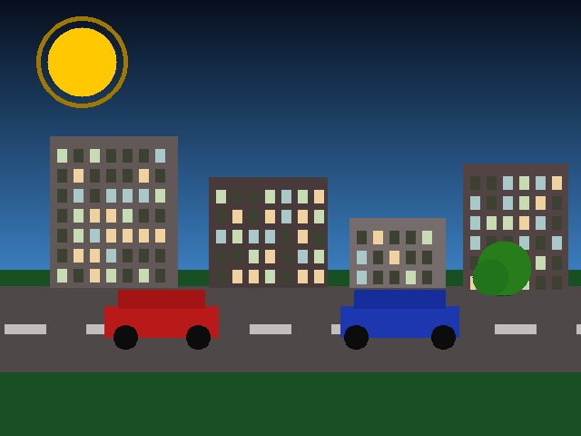
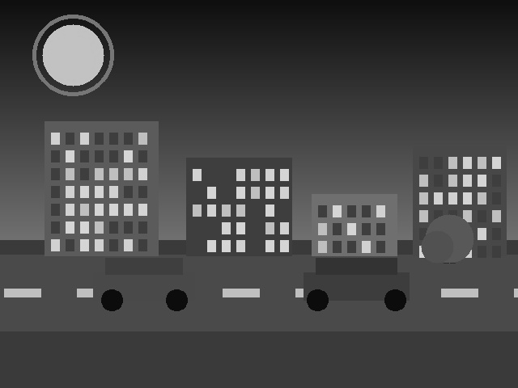
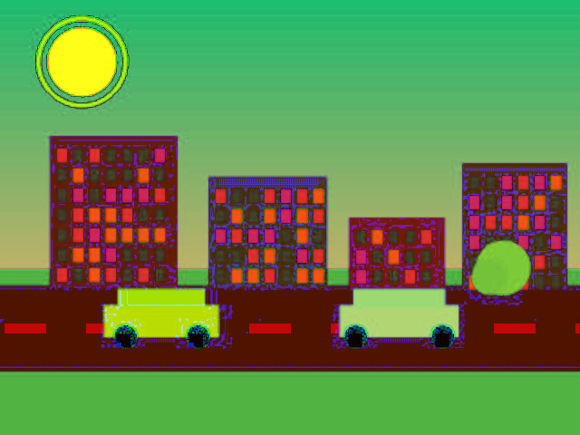
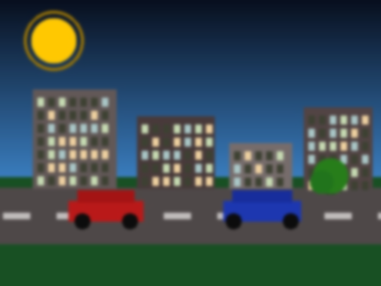
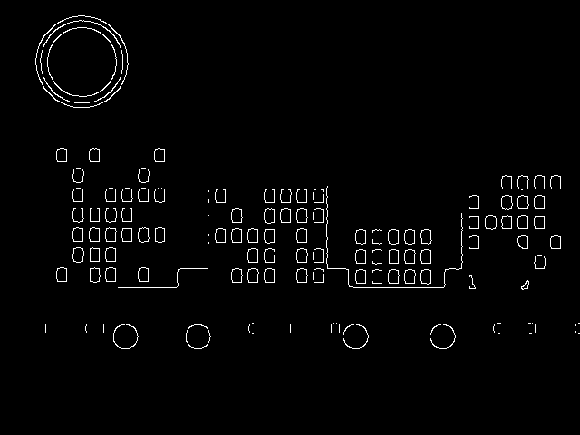
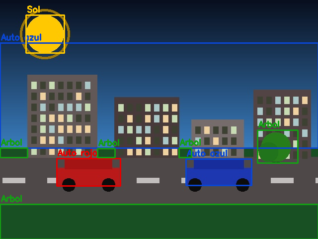
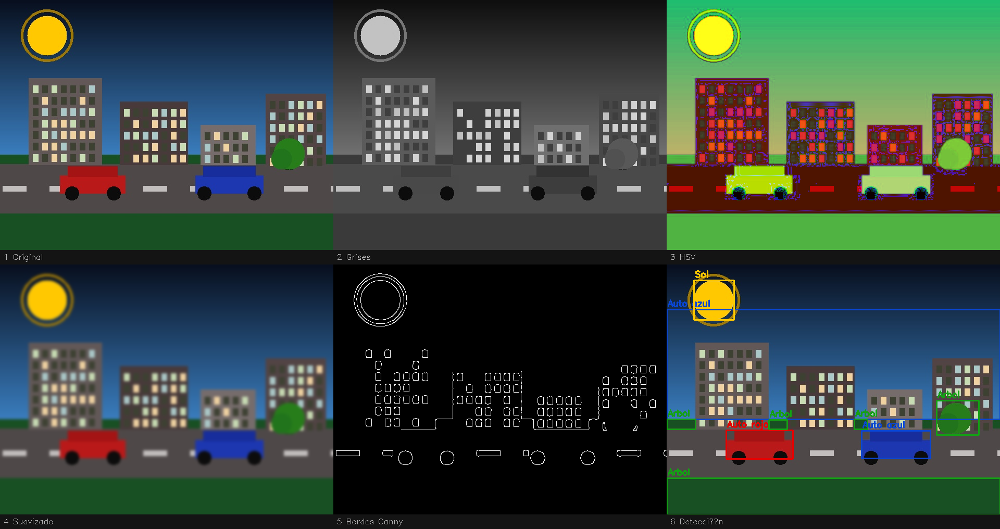

# Ejercicio 1 – Procesamiento Visual e IA

## ¿Qué problema aborda?

Construir un pipeline reproducible de procesamiento de imágenes que transforme una escena visual a través de seis etapas consecutivas —desde la carga hasta la detección de objetos— y guarde evidencia de cada paso intermedio.

---

## Herramientas y librerías

| Herramienta | Versión | Rol |
|---|---|---|
| Python | 3.13 | Lenguaje principal |
| OpenCV (`opencv-python-headless`) | 4.13 | Procesamiento de imagen |
| NumPy | ≥ 2.0 | Operaciones matriciales |
| Ultralytics / YOLOv8n | opcional | Detección con modelo preentrenado |

---

## Instalación

```bash
pip install opencv-python-headless numpy
# Opcional: detector con IA
pip install ultralytics
```

---

## Ejecución

```bash
cd ejercicio_1_procesamiento_visual
python src/main.py
```

El script detecta automáticamente si existe `data/input.jpg`.
Si no existe, genera una escena urbana sintética reproducible (`np.random.seed(42)`).

---

## Resultados visuales

### Paso 1 — Original


### Paso 2 — Escala de grises


### Paso 3 — Espacio HSV


### Paso 4 — Suavizado gaussiano


### Paso 5 — Bordes Canny


### Paso 6 — Detección de objetos


### Mosaico comparativo (todos los pasos)


---

## Fragmentos de código clave

### Generación de imagen sintética

```python
def create_synthetic_scene(W: int = 640, H: int = 480) -> np.ndarray:
    img     = np.zeros((H, W, 3), dtype=np.uint8)
    horizon = int(H * 0.62)

    # Cielo: gradiente azul oscuro → azul diurno
    for y in range(horizon):
        t = y / horizon
        img[y, :] = (int(160 * t + 30), int(110 * t + 15), int(50 * t + 8))

    # Suelo verde y calle gris
    img[horizon:, :] = (35, 80, 25)
    img[horizon + 18 : horizon + 113, :] = (72, 72, 78)
    ...
```

### Suavizado Gaussiano

```python
# Kernel 15×15, σ calculado automáticamente por OpenCV (~2.8 px)
blurred = cv2.GaussianBlur(original, (15, 15), 0)
```

### Detección de bordes Canny

```python
# Pre-suavizado 5×5 sobre grises para reducir ruido de alta frecuencia
gray_pre = cv2.GaussianBlur(gray, (5, 5), 0)
# Umbrales 50/150 → relación 1:3 recomendada por Canny (1986)
edges = cv2.Canny(gray_pre, threshold1=50, threshold2=150)
```

### Detección clásica por color HSV

```python
masks = {
    # Rojo: dos bandas porque H=0 es discontinuo
    "Auto rojo": cv2.bitwise_or(
        cv2.inRange(hsv, np.array([0,   120, 80]),  np.array([10,  255, 255])),
        cv2.inRange(hsv, np.array([168, 120, 80]),  np.array([180, 255, 255])),
    ),
    "Auto azul": cv2.inRange(hsv, np.array([100, 120, 80]), np.array([130, 255, 255])),
    "Sol":       cv2.inRange(hsv, np.array([12,  80, 160]), np.array([32,  255, 255])),
    "Arbol":     cv2.inRange(hsv, np.array([35,  50,  30]), np.array([85,  255, 190])),
}

kernel = cv2.getStructuringElement(cv2.MORPH_ELLIPSE, (7, 7))
for label, (mask, color) in masks.items():
    clean = cv2.morphologyEx(mask, cv2.MORPH_CLOSE, kernel)  # cierra huecos
    contours, _ = cv2.findContours(clean, cv2.RETR_EXTERNAL, cv2.CHAIN_APPROX_SIMPLE)
    for cnt in contours:
        if cv2.contourArea(cnt) < 350:   # filtra ruido pequeño
            continue
        x, y, w, h = cv2.boundingRect(cnt)
        cv2.rectangle(result, (x, y), (x + w, y + h), color, 2)
```

### Intento con YOLOv8

```python
def try_yolo(bgr: np.ndarray) -> np.ndarray | None:
    try:
        from ultralytics import YOLO
        model   = YOLO("yolov8n.pt")
        results = model.predict(bgr, conf=0.25, verbose=False)
        return results[0].plot()
    except Exception:
        return None   # cae al método clásico automáticamente
```

---

## Pipeline — decisiones técnicas

### Espacio HSV vs RGB/BGR
HSV fue elegido sobre RGB para segmentación porque el canal **H (tono)** es invariante ante cambios de brillo, lo que permite rangos de color estables sin ajustar umbrales por iluminación.

### Doble banda para el rojo
El tono del rojo en HSV se encuentra en H≈0° y H≈180° simultáneamente (discontinuidad circular). Se combinan dos rangos con `cv2.bitwise_or` para capturarlo completamente.

### Cierre morfológico
El kernel elíptico 7×7 en `MORPH_CLOSE` sella los pequeños huecos dentro de las máscaras de color antes de extraer contornos, evitando detectar fragmentos en lugar del objeto completo.

### Fallback automático
Si `ultralytics` no está instalado, el script cae automáticamente al detector clásico sin lanzar excepción, manteniendo el pipeline completo y reproducible.

---

## Dificultades y soluciones

| Dificultad | Solución |
|---|---|
| Rango HSV del rojo discontinuo en H=0 | Dos rangos combinados con `bitwise_or` |
| Imagen en grises sin 3 canales en el mosaico | Conversión `GRAY→BGR` antes de armar el grid |
| YOLO no disponible en el entorno | `try/except` con fallback a detección clásica |

---

## Uso de IA

Claude Sonnet 4.6 generó el esqueleto inicial del pipeline y los comentarios técnicos.
Los rangos HSV, umbrales de Canny y parámetros morfológicos fueron revisados y ajustados manualmente contra las imágenes de salida.

---

## Verificación manual

- Se abrió `resultados/comparacion.png` y se revisó que cada columna mostrara la transformación esperada.
- Se verificó que la detección dibujara cajas correctas sobre los dos vehículos, el sol y el árbol.
- Se comprobó que los nombres de archivo coincidan con los requeridos por el enunciado.
