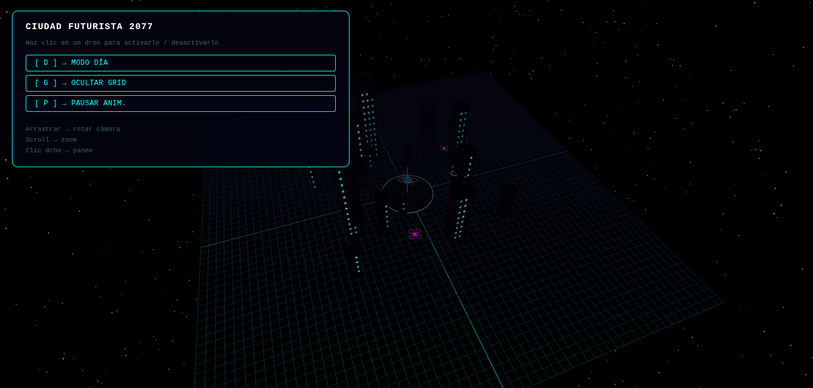
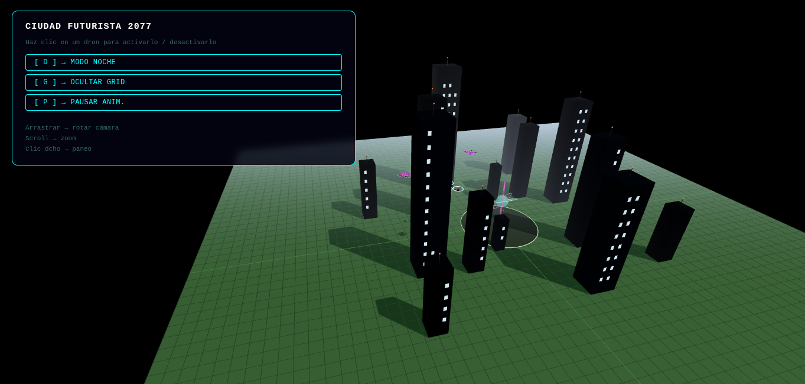
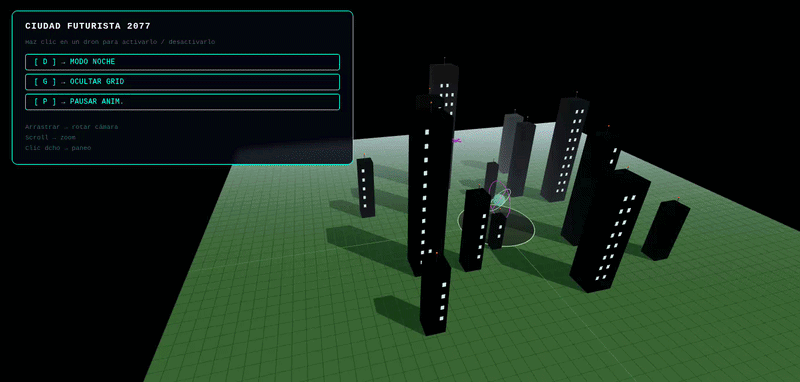

# Ejercicio 2 – Escena 3D Interactiva: Ciudad Futurista

**Tema:** Entorno futurista — ciudad nocturna 2077 con drones autónomos, edificios con iluminación de neón y un core holográfico central.

---

## ¿Qué problema aborda?

Construir una escena 3D interactiva completa que integre jerarquía de objetos, materiales PBR, iluminación dinámica, animaciones y múltiples formas de interacción del usuario, usando React Three Fiber sobre Vite.

---

## Herramientas y librerías

| Tecnología | Versión | Rol |
|---|---|---|
| Vite | ^5.4 | Bundler y servidor de desarrollo |
| React | ^18.3 | UI y gestión de estado |
| Three.js | ^0.167 | Motor de rendering WebGL |
| @react-three/fiber | ^8.17 | Binding React ↔ Three.js |
| @react-three/drei | ^9.113 | Helpers: OrbitControls, Stars |

---

## Instalación y ejecución

```bash
cd ejercicio_2_escena_3d_interactiva
npm install
npm run dev
```

Abrir `http://localhost:5173` en Chrome o Firefox.

---

## Evidencias visuales

> Las capturas y GIF generados tras ejecutar la escena se guardan en `media/`.

  | Vista nocturna con neón y drones activos |

 | Vista diurna con iluminación solar |

 | Demostración completa con animación e interacción |


## Estructura del proyecto

```
src/
├── App.jsx              ← Canvas + estado global + teclado
├── main.jsx
├── index.css
└── components/
    ├── Scene.jsx        ← Composición de toda la escena 3D
    ├── Building.jsx     ← Edificio con ventanas PBR y flotación
    ├── Drone.jsx        ← Dron jerárquico (4 niveles)
    ├── GridFloor.jsx    ← Suelo + cuadrícula de neón
    ├── CityCore.jsx     ← Esfera holográfica + anillos orbitales
    └── UIPanel.jsx      ← Panel de control HTML superpuesto
```

---

## Requerimientos cumplidos

### Jerarquía de objetos (4 niveles en el dron)

```
groupRef          (nivel 0) – órbita + bob vertical
├─ cuerpo central (nivel 1) – PBR, glow principal
├─ anillo estado  (nivel 1) – pulsa cuando activo
├─ indicador LED  (nivel 1) – estrobo blanco / rojo fijo
├─ domo cámara    (nivel 1) – esfera cristal oscuro
└─ Arm × 4        (nivel 2) – brazo + tira LED + luz navegación
    ├─ varilla
    ├─ tira LED
    ├─ luz nav (parpadea)
    └─ group motor (nivel 3)
        ├─ carcasa
        └─ Rotor   (nivel 4)
            ├─ pala A
            ├─ pala B
            └─ aro de seguridad
```

### Transformaciones

- **Traslación**: 15 edificios en anillos concéntricos; 3 drones en órbitas independientes.
- **Rotación**: el dron apunta siempre en la dirección de movimiento (`rotation.y = -angle + PI/2`); rotores a 22 rad/s.
- **Escala**: edificios con `h` entre 6 y 30; drones con `size` 0.7, 1.0 y 1.5.

### Fragmento – animación de órbita y bob

```jsx
useFrame((state, delta) => {
  // Dron inactivo sigue moviéndose al 15% de velocidad
  const speedMul = 0.15 + activeLevelRef.current * 0.85
  angle.current += delta * orbitSpeed * speedMul

  const x   = Math.cos(angle.current) * orbitRadius
  const z   = Math.sin(angle.current) * orbitRadius
  const bob = height + Math.sin(state.clock.elapsedTime * 1.6 + initialAngle) * (0.12 + a * 0.32)

  groupRef.current.position.set(x, bob, z)
  groupRef.current.rotation.y = -angle.current + Math.PI / 2
})
```

### Materiales PBR

```jsx
// Cuerpo del dron: metálico y con glow que se controla por ref
<meshStandardMaterial
  ref={bodyMatRef}
  color={color}
  emissive={color}
  emissiveIntensity={0.65}   // actualizado en useFrame
  metalness={0.82}
  roughness={0.18}
/>

// Edificio: metalness alto, roughness medio
<meshStandardMaterial
  color={color}
  metalness={0.72}
  roughness={0.28}
  emissive={color}
  emissiveIntensity={0.04}
/>
```

### Iluminación coherente

```jsx
// Noche: 4 point lights de neón
<pointLight position={[-16, 18, 0]}  intensity={2.5} color="#00ffff" distance={50} />
<pointLight position={[ 16, 12, 6]}  intensity={2.5} color="#ff00ff" distance={50} />
<pointLight position={[  0,  9, 20]} intensity={2.0} color="#8800ff" distance={45} />
<pointLight position={[-10,  6,-15]} intensity={1.5} color="#0088ff" distance={40} />

// Luz ventral de cada dron activo
<pointLight ref={lightRef} position={[0, -0.42, 0]} intensity={2.2} color={color} distance={10} />
```

### Animaciones con `useFrame`

| Elemento | Animación | Tasa de lerp |
|---|---|---|
| Nivel actividad (glow) | `MathUtils.lerp(δ×3.5)` | Rápida |
| Rotores (RPM) | `MathUtils.lerp(δ×1.2)` | Lenta — wind-down |
| Anillo de estado | `sin(t×2.8)` pulsante | – |
| Edificios | `sin(t×0.32 + fase)` flotación | – |
| Core holográfico | `sin(t×2.1)` escala y brillo | – |
| Anillos del core | `rotation.y += δ×speed` | – |

### Fragmento – activación/desactivación con cascada

```jsx
// En Drone.jsx: el brillo baja rápido, las aspas frenan lento
activeLevelRef.current = THREE.MathUtils.lerp(
  activeLevelRef.current, active ? 1 : 0, delta * 3.5
)

// En Rotor.jsx: wind-down más gradual
rpmRef.current = THREE.MathUtils.lerp(rpmRef.current, a * 22, delta * 1.2)
bladesRef.current.rotation.y += delta * rpmRef.current
```

Efecto visual resultante:
1. Clic → **flash** instantáneo (flashRef=1, decae a δ×5)
2. **Cuerpo y anillo** se apagan en ~0.3 s (rate 3.5)
3. **Rotores** se frenan en ~1.5 s (rate 1.2) — se ven las aspas deteniéndose

### Interacción del usuario

| Acción | Efecto |
|---|---|
| **Clic en dron** | Flash + activa/desactiva glow y rotores |
| **Tecla D / botón** | Modo día ↔ noche (luces, niebla, estrellas, grid) |
| **Tecla G / botón** | Muestra/oculta cuadrícula de neón |
| **Tecla P / botón** | Pausa/reanuda todas las animaciones |
| **Arrastrar** | Rota la cámara (OrbitControls) |
| **Scroll** | Zoom |
| **Clic derecho** | Paneo |

### Fragmento – teclado en App.jsx

```jsx
useEffect(() => {
  const onKey = (e) => {
    const k = e.key.toLowerCase()
    if (k === 'd') setDayMode(v => !v)
    if (k === 'g') setGridVisible(v => !v)
    if (k === 'p') setAnimPaused(v => !v)
  }
  window.addEventListener('keydown', onKey)
  return () => window.removeEventListener('keydown', onKey)
}, [])
```

### Fragmento – ventanas deterministas (sin Math.random en render)

```jsx
const windows = useMemo(() => {
  const wins = []
  for (let f = 1; f < Math.floor(h / 2.15); f++) {
    for (let c = 0; c < Math.max(1, Math.floor(w / 1.5)); c++) {
      // sin() como PRNG determinista → mismas ventanas en cada render
      const lit = Math.sin(index * 137.5 + f * 31.3 + c * 17.7) > -0.25
      if (!lit) continue
      wins.push({
        x: (c - (cols - 1) / 2) * 1.35,
        y: f * 2.1 + 1.0,
        intensity: 0.45 + 0.55 * Math.abs(Math.sin(index * 7 + f * 3 + c)),
      })
    }
  }
  return wins
}, [h, w, index])
```

---

## Decisiones técnicas

- **`activeLevelRef` compartido por referencia**: evita re-renders innecesarios al pasar el estado de activación a hijos; solo se escribe en el `useFrame` del padre y se lee en los de los hijos.
- **Velocidades de lerp diferenciadas**: el brillo baja a rate 3.5 pero los rotores frenan a rate 1.2, creando una animación de "apagado" visualmente convincente.
- **Luz nav con fase por brazo**: cada luz de navegación parpadea con `sin(t×5 + phase)` distinto, generando efecto visual más dinámico.
- **Flash en toggle**: `flashRef.current = 1` al hacer clic añade una ráfaga de emissiveIntensity que decae en ~0.2 s.
- **`stopPropagation`** en el click del dron para que el OrbitControls no capture el evento.

---

## Dificultades y soluciones

| Dificultad | Solución |
|---|---|
| `Math.random()` en render produce ventanas diferentes cada frame | `useMemo` con hash determinista `sin(seed)` |
| `useRef` no puede llamarse dentro de `.map()` | Cada `Rotor` y `Arm` es un componente independiente con su propio ref |
| Materiales no actualizaban desde `useFrame` sin ref | Se añadió `ref` a cada `<meshStandardMaterial>` que necesita animación |
| El dron giraba hacia la dirección incorrecta | `rotation.y = -angle + PI/2` (el signo negativo cancela la dirección de atan2) |

---

## Uso de IA

Claude Sonnet 4.6 generó la estructura de componentes y los valores iniciales de iluminación.
El diseño de la ciudad (posiciones, alturas, radios de órbita, tasas de lerp) fue ajustado manualmente hasta lograr la estética deseada.

---

## Verificación manual

- Se ejecutó `npm run dev` y se probó en Chrome con DevTools abierto.
- Se verificó que el clic en cada dron produjera el flash y la transición de activación/desactivación.
- Se comprobó que los rotores se frenen visualmente más despacio que el glow.
- Se revisó la jerarquía de objetos con la extensión Three.js Inspector.
- Se probaron los tres modos: día, noche y animaciones pausadas.
