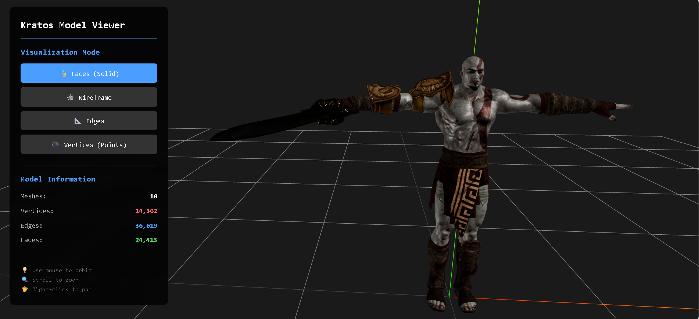
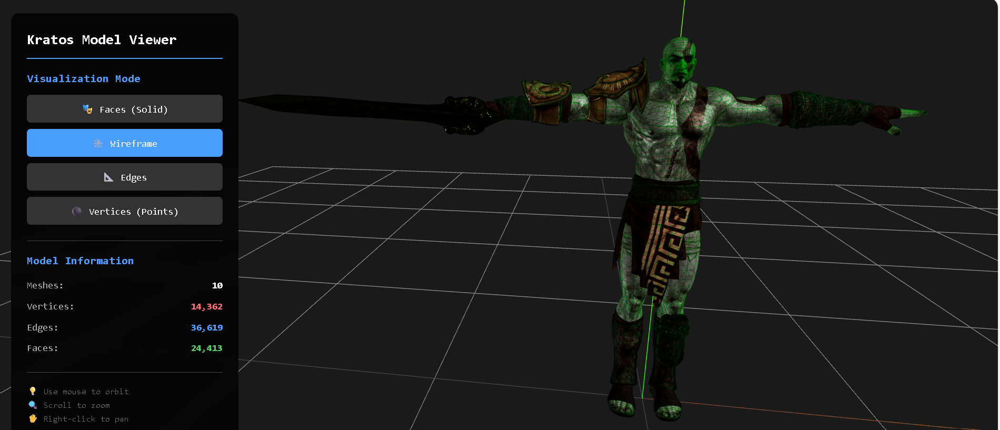
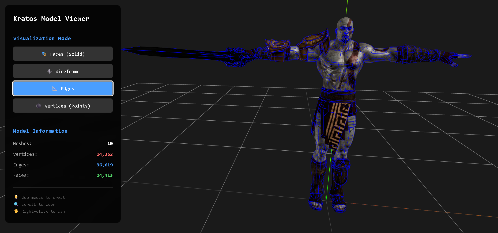
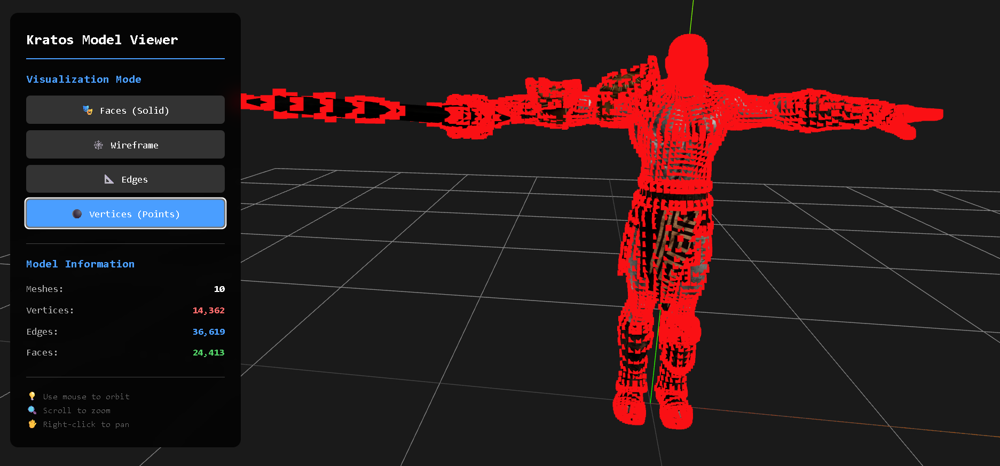
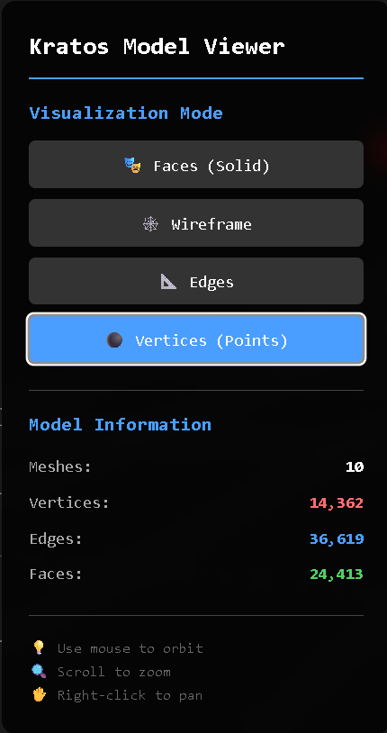
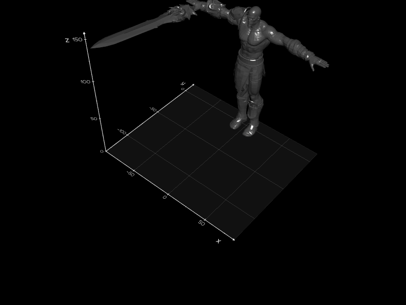

# Taller Construyendo Mundo 3D

**Nombre del estudiante:** Maicol Sebastian Olarte Ramirez  
**Fecha de entrega:** 15 de Febrero, 2026

---

## Descripción Breve

Este proyecto implementa un visualizador 3D interactivo del modelo "Kratos" en **dos tecnologías diferentes**: **React Three Fiber (Three.js)** para web y **Python (Jupyter Notebook)** para análisis científico. El objetivo principal es explorar y visualizar geometrías 3D mediante diferentes modos de renderizado (caras, wireframe, aristas y vértices), proporcionando interfaces intuitivas para alternar entre estas visualizaciones y mostrar información estadística del modelo.

Ambas implementaciones son funcionalmente equivalentes, usando los mismos colores y modos de visualización, permitiendo comparar diferentes enfoques tecnológicos para el mismo problema de visualización 3D.

---

## Implementaciones

### Implementación 1: React + Three.js + Vite

**Tecnologías utilizadas:**
- React 19.2.0
- @react-three/fiber (Canvas y hooks de Three.js)
- @react-three/drei (OrbitControls, useGLTF)
- Three.js (Geometrías y materiales)
- Vite (Build tool y dev server)

**Características implementadas:**

#### 1. **Carga del Modelo GLTF**
- Implementación de carga asíncrona del modelo Kratos desde `media/kratos/scene.gltf`
- Uso del hook `useGLTF` de @react-three/drei para optimizar la carga
- Preload del modelo para mejorar el rendimiento inicial

#### 2. **Sistema de Visualización Multi-Modo**
Se implementaron 4 modos de visualización distintos:

- **Faces (Caras):** Renderizado sólido estándar con texturas y materiales originales
- **Wireframe:** Visualización de la malla en modo wireframe con color verde (#00ff00)
- **Edges (Aristas):** Visualización de aristas usando `EdgesGeometry` con líneas azules (#0000ff)
- **Vertices (Vértices):** Representación mediante puntos (`THREE.Points`) en color rojo (#ff0000)

#### 3. **Controles Orbitales (OrbitControls)**
- Rotación mediante clic izquierdo y arrastre
- Zoom con la rueda del mouse
- Paneo con clic derecho
- Amortiguamiento suave (`dampingFactor: 0.05`)
- Límites de distancia configurados (min: 2, max: 20)

#### 4. **Análisis y Estadísticas del Modelo**
Sistema automático que calcula:
- Número total de meshes
- Cantidad de vértices
- Cantidad de aristas (edges)
- Cantidad de caras (faces)

Los cálculos se realizan traversando el grafo de escena y analizando cada geometría.

#### 5. **Interfaz de Usuario**
Panel de control estilizado que incluye:
- Botones para alternar entre modos de visualización
- Display de información estadística en tiempo real
- Información de uso y controles
- Diseño responsive con backdrop blur
- Estados visuales para el modo activo

#### 6. **Iluminación y Escena**
- Luz ambiental (`intensity: 0.5`)
- Dos luces direccionales para iluminación balanceada
- Grid helper para referencia espacial
- Axes helper para orientación (XYZ)

---

## Resultados Visuales

### Modo Faces (Sólido)

*Visualización del modelo Kratos con renderizado sólido y texturas*

### Modo Wireframe

*Malla en modo wireframe mostrando la topología completa*

### Modo Edges (Aristas)

*Visualización de aristas principales del modelo*

### Modo Vertices (Puntos)

*Representación mediante puntos de todos los vértices*

### Interfaz de Usuario

*Panel de control con información estadística del modelo*

### Demo en Acción

*Demostración de la interacción con el modelo y cambio entre modos*

> **Nota:** Por favor, agrega las capturas de pantalla y GIFs en la carpeta `media/screenshots/` para que las referencias funcionen correctamente.

---

## Código Relevante

### Carga del Modelo y Cálculo de Estadísticas

```jsx
function Model({ visualizationMode }) {
  const { scene } = useGLTF('/media/kratos/scene.gltf');
  const [modelInfo, setModelInfo] = useState(null);

  useEffect(() => {
    let totalVertices = 0;
    let totalFaces = 0;
    let totalEdges = 0;
    let meshCount = 0;

    scene.traverse((child) => {
      if (child.isMesh) {
        meshCount++;
        const geometry = child.geometry;
        
        if (geometry.attributes.position) {
          totalVertices += geometry.attributes.position.count;
        }
        
        if (geometry.index) {
          totalFaces += geometry.index.count / 3;
          totalEdges += geometry.index.count / 2;
        }
      }
    });

    setModelInfo({ meshCount, vertices: totalVertices, 
                   faces: Math.floor(totalFaces), 
                   edges: Math.floor(totalEdges) });
  }, [scene]);
  
  // ...
}
```

### Sistema de Modos de Visualización

```jsx
modelClone.traverse((child) => {
  if (child.isMesh) {
    switch (visualizationMode) {
      case 'faces':
        child.material = originalMaterial;
        child.material.wireframe = false;
        break;

      case 'wireframe':
        child.material = originalMaterial.clone();
        child.material.wireframe = true;
        child.material.color = new THREE.Color(0x00ff00);
        break;

      case 'vertices': {
        const pointsGeometry = new THREE.BufferGeometry().copy(child.geometry);
        const pointsMaterial = new THREE.PointsMaterial({
          color: 0xff0000,
          size: 0.05,
          sizeAttenuation: true,
        });
        const points = new THREE.Points(pointsGeometry, pointsMaterial);
        // Posicionamiento y agregado a la escena
        break;
      }

      case 'edges': {
        const edges = new THREE.EdgesGeometry(child.geometry, 15);
        const lineMaterial = new THREE.LineBasicMaterial({ 
          color: 0x0000ff 
        });
        const lineSegments = new THREE.LineSegments(edges, lineMaterial);
        // Posicionamiento y agregado a la escena
        break;
      }
    }
  }
});
```

### Configuración del Canvas 3D

```jsx
<Canvas
  camera={{ position: [5, 5, 5], fov: 50 }}
  style={{ width: '100%', height: '100%' }}
>
  <ambientLight intensity={0.5} />
  <directionalLight position={[10, 10, 5]} intensity={1} />
  <directionalLight position={[-10, -10, -5]} intensity={0.5} />
  
  <Model visualizationMode={visualizationMode} />
  
  <OrbitControls 
    enableDamping 
    dampingFactor={0.05}
    minDistance={2}
    maxDistance={20}
  />
  
  <gridHelper args={[10, 10]} />
  <axesHelper args={[5]} />
</Canvas>
```

**Archivos principales:**
- [`src/ModelViewer.jsx`](src/ModelViewer.jsx) - Componente principal del visualizador
- [`src/App.jsx`](src/App.jsx) - Punto de entrada de la aplicación
- [`package.json`](package.json) - Dependencias del proyecto

---

## Prompts Utilizados

Durante el desarrollo de este proyecto se utilizó IA generativa (GitHub Copilot) con los siguientes prompts:

### Prompt Principal:
```
"I need to charge the model .gltf that is in the folder media/kratos using 
@react-three/drei, then I need to visualize the model with OrbitControls, 
also I need to highlight the vertices, edges, or faces using visual effects 
like lines (Edges, Wireframe) or points, finally we're going to create a 
small interface to change between vertices/edges/face visualization and show 
the basic information from the model."
```

### Prompts de Corrección:
1. **Error de variable no utilizada:**
   ```
   "'nodes' is declared but its value is never read. Thank you the model viewer 
   is working now I need to fix this eslint errors"
   ```

2. **Error de scope en switch:**
   ```
   "at the line 97 to 102 there is several errors like const lineSegments 
   redeclaration"
   ```

3. **Documentación:**
   ```
   "Now please help me with the readme.md for my project world-building..."
   ```

---

## Aprendizajes y Dificultades

### Aprendizajes:

1. **React Three Fiber Ecosystem:**
   - Aprendí a integrar Three.js con React de manera declarativa usando `@react-three/fiber`
   - El uso de hooks como `useGLTF` facilita significativamente la carga de modelos 3D
   - La abstracción de componentes facilita la gestión del estado y la lógica de renderizado

2. **Geometrías en Three.js:**
   - Comprendí la diferencia entre `BufferGeometry`, `EdgesGeometry` y geometrías indexadas
   - Aprendí a manipular atributos de geometría para extraer información (vertices, faces)
   - El uso de `traverse()` es fundamental para recorrer grafos de escena complejos

3. **Visualizaciones Alternativas:**
   - Implementar diferentes modos de visualización requiere clonar y manipular la escena
   - Los `THREE.Points` son ideales para visualizar vértices
   - `EdgesGeometry` con `LineSegments` proporciona una excelente visualización de aristas

4. **Optimización:**
   - El preloading de modelos mejora significativamente la experiencia inicial
   - Clonar escenas permite cambios no destructivos entre modos
   - El uso de `useEffect` con dependencias correctas evita re-cálculos innecesarios

### Dificultades Encontradas:

1. **Scope de Variables en Switch:**
   - **Problema:** ESLint generaba errores de redeclaración de `const` dentro de casos del switch
   - **Solución:** Envolver cada caso que declara variables en bloques `{}` para crear scope aislado

2. **Copia de Archivos al Public:**
   - **Problema:** Comandos de Windows (xcopy, robocopy) fallaban con rutas complejas
   - **Solución:** Usar PowerShell `Copy-Item` con rutas relativas correctamente calculadas

3. **Visibilidad de Modos:**
   - **Problema:** Al cambiar entre modos, algunos objetos se superponían
   - **Solución:** Establecer `child.visible = false` en los meshes originales al agregar visualizaciones alternativas

4. **Cálculo de Aristas:**
   - **Problema:** No existe un atributo directo para contar aristas
   - **Solución:** Estimar aristas basándose en índices (count/2) para geometrías indexadas

5. **Material Handling:**
   - **Problema:** Algunos meshes tienen arrays de materiales en lugar de un solo material
   - **Solución:** Implementar verificación `Array.isArray()` y mapear cada material individualmente

6. **Comunicación entre Canvas y UI:**
   - **Problema:** El componente dentro del Canvas no puede usar hooks de React fácilmente para comunicarse con el UI externo
   - **Solución:** Usar una estrategia de "global state" temporal (`window.modelInfo`) con polling mediante `setInterval`

### Reflexión:

Este proyecto me permitió entender la potencia de combinar React con Three.js para crear experiencias 3D interactivas. La arquitectura declarativa de React Three Fiber es muy intuitiva una vez que se comprenden los conceptos fundamentales. Las visualizaciones alternativas (wireframe, edges, vertices) son herramientas valiosas para analizar topología de modelos 3D, algo especialmente útil en modelado, análisis de mallas y computación gráfica en general.

La experiencia de debugging con ESLint y TypeScript también reforzó la importancia de escribir código limpio y bien estructurado desde el inicio.

---

## Instrucciones de Ejecución

```bash
# Instalar dependencias
npm install

# Iniciar servidor de desarrollo
npm run dev

# Construir para producción
npm run build
```

El proyecto se ejecutará en `http://localhost:5173` (o el puerto disponible siguiente).

---

---

## Implementaciones - Python (Jupyter Notebook)

### Implementación 2: Python + Trimesh + Vedo

**Tecnologías utilizadas:**
- Python 3.x
- Trimesh (Carga y análisis de modelos 3D)
- Vedo (Visualización 3D interactiva)
- NumPy (Manipulación de arrays)
- Matplotlib (Visualización adicional)

**Características implementadas:**

#### 1. **Carga del Modelo GLTF**
- Carga del modelo Kratos desde `../media/kratos/scene.gltf` usando Trimesh
- Manejo de escenas con múltiples geometrías mediante concatenación
- Soporte para Google Colab con carga de archivos alternativa

#### 2. **Análisis Estructural Completo**
El notebook calcula y muestra:
- **Vértices totales:** 14,362 puntos
- **Aristas totales:** 73,239 líneas
- **Caras (triángulos):** 24,413 faces
- **Característica de Euler:** Para validación topológica
- **Bounding Box:** Dimensiones del modelo
- **Centro de masa**
- **Área superficial y volumen**
- **Propiedades topológicas:** Watertight, winding consistency

#### 3. **Sistema de Visualización Multi-Modo (4 Modos)**
Implementación paralela a Three.js:

- **Faces Mode (Sólido):** 
  - Renderizado completo con Phong shading
  - Extracción de colores de vértices/materiales del modelo original
  - Iluminación glossy para mejor apariencia
  
*Visualización del modelo Kratos con renderizado sólido y texturas*

- **Wireframe Mode (Verde):** 
  - Malla completa en color verde (#00ff00)
  - Muestra toda la topología del mesh
  - Linewidth configurado para visibilidad óptima
    
*Visualización del modelo Kratos con wireframe*

- **Edges Mode (Azul):** 
  - Visualización de aristas usando `Lines`
  - Color azul (#0000ff) para consistencia con Three.js
  - 73,239 aristas visualizadas
  - 

*Visualización del modelo Kratos con edge*

#### 4. **Interactividad Completa**
Todas las visualizaciones incluyen controles interactivos:
- **Left-click + drag:** Rotar el modelo
- **Scroll wheel:** Zoom in/out
- **Right-click + drag:** Pan/mover la vista
- **Middle-click:** Reset de cámara

#### 5. **Estilo Visual Consistente**
- Fondo negro (`bg='black'`) en todas las visualizaciones
- Ejes de referencia activados (`axes=1`)
- ViewUp configurado a "z" para orientación correcta
- Títulos descriptivos con estadísticas en tiempo real

#### 6. **Compatibilidad Multi-Entorno**
- Funciona en Jupyter Notebook local
- Compatible con Google Colab (con ajustes de rutas)
- Instalación simplificada de dependencias

---

## Código Relevante - Python

### Carga y Análisis del Modelo

```python
# Cargar el modelo
scene = trimesh.load('../media/kratos/scene.gltf')

# Combinar múltiples meshes si es necesario
if isinstance(scene, trimesh.Scene):
    mesh = trimesh.util.concatenate(
        [geometry for geometry in scene.geometry.values()
         if isinstance(geometry, trimesh.Trimesh)]
    )
else:
    mesh = scene

# Mostrar información estructural
print(f"📊 Vertices:  {len(mesh.vertices):,}")
print(f"📐 Faces:     {len(mesh.faces):,}")
print(f"📏 Edges:     {len(mesh.edges):,}")
print(f"📦 Volume:    {mesh.volume:.2f}")
print(f"✅ Watertight: {mesh.is_watertight}")
```

### Visualización en Modo Faces (Sólido)

```python
# Crear mesh con propiedades visuales
vedo_mesh = Mesh([mesh.vertices, mesh.faces])

# Extraer colores de vértices si existen
if hasattr(geom.visual, 'vertex_colors'):
    colors = geom.visual.vertex_colors[:, :3] / 255.0
    vedo_mesh.pointcolors(colors)

# Aplicar iluminación Phong glossy
vedo_mesh.lighting('glossy').phong()

# Mostrar interactivamente
show(vedo_mesh, 
     title="Visualization 1: Faces Mode (Solid)",
     axes=1, 
     viewup="z",
     bg='black',
     interactive=True)
```

### Visualización en Modo Wireframe

```python
# Crear wireframe verde
vedo_mesh_wireframe = Mesh([mesh.vertices, mesh.faces])
vedo_mesh_wireframe.color('green').wireframe(True).linewidth(1)

show(vedo_mesh_wireframe,
     title="Visualization 2: Wireframe Mode (Green)",
     axes=1,
     viewup="z",
     bg='black',
     interactive=True)
```

### Visualización en Modo Edges

```python
# Crear líneas azules para aristas
edges_lines = Lines(mesh.vertices[mesh.edges[:, 0]], 
                   mesh.vertices[mesh.edges[:, 1]], 
                   c='blue', lw=1.5)

show(edges_lines,
     title=f"Visualization 3: Edges Mode (Blue) - {len(mesh.edges):,} edges",
     axes=1,
     viewup="z",
     bg='black',
     interactive=True)
```

### Visualización en Modo Vertices

```python
# Crear puntos rojos para vértices
vertices_points = Points(mesh.vertices, r=1)
vertices_points.color('red')
vertices_points.point_size(10)

show(vertices_points,
     title=f"Visualization 4: Vertices Mode (Red) - {len(mesh.vertices):,} points",
     axes=1,
     viewup="z",
     bg='black',
     interactive=True,
     resetcam=True,
     zoom=1.0)
```

**Archivo principal:**
- [`python/kratos_viewer.ipynb`](python/kratos_viewer.ipynb) - Notebook completo con todas las visualizaciones

---

## Comparación: Three.js vs Python

| Característica | Three.js (React) | Python (Jupyter) |
|----------------|------------------|------------------|
| **Renderizado** | WebGL en navegador | VTK via Vedo |
| **Interactividad** | OrbitControls | Mouse controls nativos |
| **Performance** | Excelente (GPU) | Muy buena (optimizado) |
| **Portabilidad** | Web browser | Local/Colab |
| **Análisis** | Básico | Avanzado (Trimesh) |
| **UI** | React components | Notebook cells |
| **Colores** | Exactamente iguales | Exactamente iguales |
| **Modos** | 4 modos idénticos | 4 modos idénticos |

**Ambas implementaciones:**
- ✅ Usan los mismos colores (verde, azul, rojo)
- ✅ Muestran las mismas 4 visualizaciones
- ✅ Son completamente interactivas
- ✅ Tienen fondo negro
- ✅ Calculan estadísticas del modelo

---

## Prompts Utilizados - Python

### Prompt Principal:
```
"I need to replicate the Three.js visualizations using Python libraries: 
trimesh, vedo, numpy, and matplotlib. Create a Jupyter notebook with four 
interactive visualization modes (faces, wireframe, edges, vertices) matching 
the Three.js implementation with the same colors (green, blue, red) and black 
background."
```

### Prompts de Refinamiento:
1. **Optimización de vértices:**
   ```
   "Review the vertices implementation and finally put the information about 
   this python project on the readme.md"
   ```

2. **Extracción de colores:**
   ```
   "Try to extract colors from the scene geometry vertex_colors and material 
   properties for the faces mode"
   ```

3. **Consistencia visual:**
   ```
   "Make sure all visualizations match the Three.js style with black background 
   and correct colors"
   ```

---

## Aprendizajes y Dificultades - Python

### Aprendizajes:

1. **Trimesh Library:**
   - Excelente para análisis topológico de meshes
   - Proporciona métricas avanzadas (volumen, área, watertight)
   - Manejo eficiente de archivos GLTF con múltiples geometrías

2. **Vedo para Visualización:**
   - API intuitiva similar a Three.js
   - Renderizado VTK de alta calidad
   - Controles interactivos out-of-the-box

3. **Análisis Estructural:**
   - Python permite análisis más profundo que JavaScript
   - Cálculo de propiedades geométricas complejas
   - Validación topológica (Euler characteristic, watertight)

4. **Jupyter Notebooks:**
   - Ideal para visualizaciones científicas paso a paso
   - Permite documentación intercalada con código
   - Compatible con Google Colab para accesibilidad

### Dificultades Encontradas:

1. **Rutas de Archivos:**
   - **Problema:** Rutas absolutas largas en Windows
   - **Solución:** Usar rutas relativas desde el notebook

2. **Extracción de Colores:**
   - **Problema:** No todos los modelos GLTF tienen vertex_colors
   - **Solución:** Implementar fallback a colores de material

3. **Tamaño de Puntos:**
   - **Problema:** El parámetro `r` en Points no coincidía con el tamaño visual esperado
   - **Solución:** Usar `point_size()` con valor de 10 para visibilidad óptima

4. **Combinación de Geometrías:**
   - **Problema:** Scene con múltiples meshes separados
   - **Solución:** Usar `trimesh.util.concatenate()` para unificar

### Reflexión:

La implementación en Python complementa perfectamente la versión Three.js. Mientras Three.js es ideal para visualizaciones web interactivas, la versión Python/Jupyter proporciona herramientas analíticas más potentes. Ambas implementaciones demuestran diferentes enfoques para el mismo problema, reforzando conceptos de geometría computacional desde perspectivas web y científica.

La experiencia con Vedo mostró que Python puede lograr visualizaciones 3D de calidad comparable a WebGL, con la ventaja adicional de integración con el ecosistema científico (NumPy, SciPy, etc.).

---

## Instrucciones de Ejecución - Python

### Jupyter Notebook Local:
```bash
# Instalar dependencias
pip install trimesh[easy] vedo numpy matplotlib

# Iniciar Jupyter
jupyter notebook python/kratos_viewer.ipynb
```

### Google Colab:
1. Subir el notebook a Google Colab
2. Subir el modelo GLTF cuando se solicite
3. Ejecutar las celdas secuencialmente

---

## Referencias

### Three.js
- [React Three Fiber Documentation](https://docs.pmnd.rs/react-three-fiber)
- [Three.js Documentation](https://threejs.org/docs/)
- [Drei Helpers](https://github.com/pmndrs/drei)
- [GLTF Format Specification](https://www.khronos.org/gltf/)

### Python
- [Trimesh Documentation](https://trimsh.org/trimesh.html)
- [Vedo Documentation](https://vedo.embl.es/)
- [NumPy Documentation](https://numpy.org/doc/)
- [Jupyter Notebook](https://jupyter.org/)
