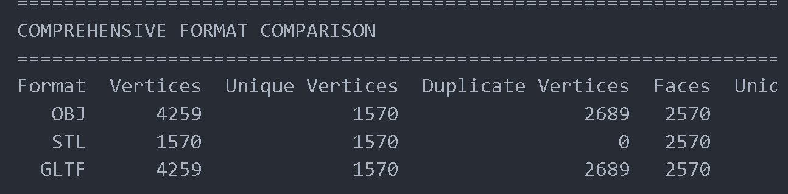
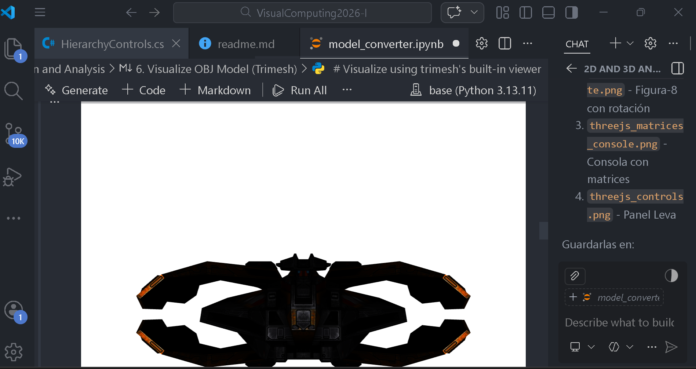
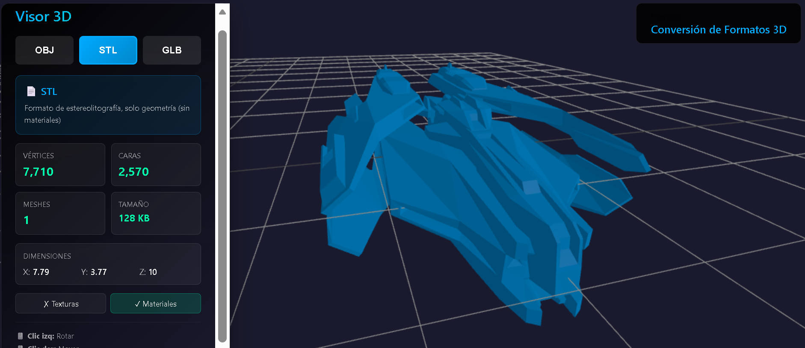
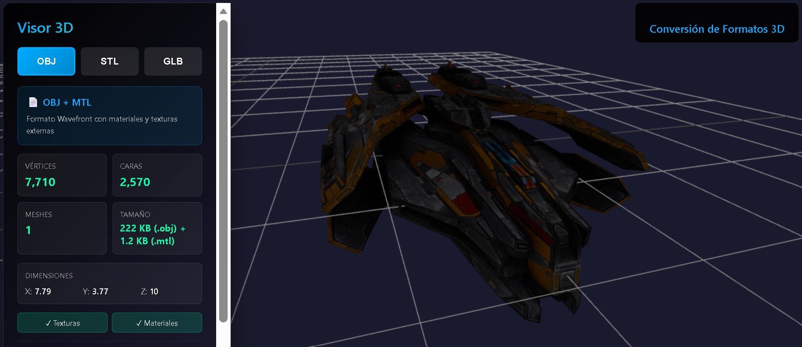
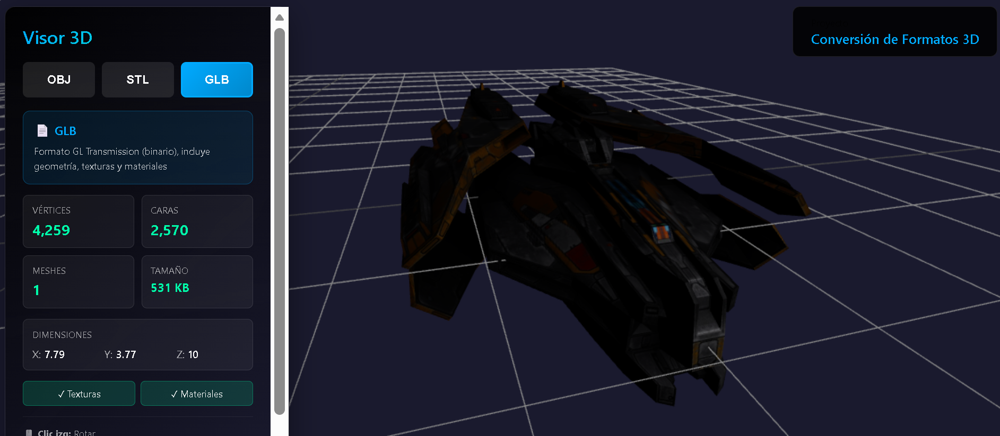

# Taller Conversión Formatos 3D

**Estudiante:** Maicol Sebastian Olarte Ramirez 
**Fecha de entrega:** 17 de Febrero, 2026

---

## 📋 Descripción

Este taller explora la conversión entre diferentes formatos de modelos 3D (OBJ, STL, GLTF/GLB) y su visualización tanto en entornos Python como en navegadores web con Three.js. El objetivo es comprender las características, ventajas y limitaciones de cada formato, así como desarrollar herramientas para su análisis y visualización interactiva.

**Modelo utilizado:** SciFi Fighter (nave espacial con 7,710 vértices y materiales PBR)

---

## 🛠️ Implementaciones

### 1. Entorno Python (Jupyter Notebook)

**Archivo:** `python/model_converter.ipynb`

Herramienta de conversión y análisis de modelos 3D utilizando:
- **trimesh**: Carga y conversión de formatos
- **open3d**: Visualización y procesamiento avanzado
- **pandas**: Generación de reportes comparativos
- **matplotlib**: Gráficos de análisis

**Funcionalidades:**
- Conversión automática entre OBJ, STL y GLTF/GLB
- Análisis de geometría (vértices, caras, bounding box)
- Comparación de tamaños de archivo
- Exportación de reportes en CSV
- Visualización 3D interactiva

**Formatos soportados:**
- **OBJ + MTL:** Formato Wavefront con materiales y texturas externas
- **STL:** Estereolitografía, solo geometría (meshes triangulares)
- **GLB:** GL Transmission Format (binario), incluye todo embebido

---

### 2. Entorno Three.js (React + Vite)

**Directorio:** `threejs/`

Visor web interactivo de modelos 3D con interfaz moderna y responsive.

**Stack tecnológico:**
- React 19.2.0
- Three.js (última versión)
- Vite 7.3.1
- OrbitControls para navegación 3D

**Características:**
- Carga dinámica de 3 formatos (OBJ, STL, GLB)
- Cambio en tiempo real entre formatos
- Información detallada del modelo:
  - Número de vértices y caras
  - Cantidad de meshes
  - Tamaño de archivo
  - Dimensiones (bounding box)
  - Detección de texturas y materiales
- Controles de cámara intuitivos (rotar, mover, zoom)
- Interfaz con glassmorphism y gradientes
- Posicionamiento automático y escalado de modelos

**Optimizaciones implementadas:**
- Protección contra doble montaje (React Strict Mode)
- Limpieza adecuada de geometrías y materiales
- Dispose de texturas para evitar memory leaks
- Scroll en panel de información para pantallas pequeñas

---

## 📸 Resultados Visuales

### Implementación Python


*Notebook de conversión mostrando análisis comparativo de formatos*


*Visualización 3D en Open3D del modelo STL*

### Implementación Three.js


*Formato STL con geometría básica en color azul*


*Formato OBJ con texturas y materiales completos*


*Formato GLB con todos los assets embebidos*


*Panel de información compacto con estadísticas del modelo*

> **Nota:** Las capturas de pantalla deben colocarse en la carpeta `media/screenshots/`

---

## 💻 Código Relevante

### Python - Conversión de formatos

```python
import trimesh
import open3d as o3d

# Cargar modelo OBJ
mesh = trimesh.load('source/model.obj', force='mesh')

# Exportar a STL
mesh.export('converted/model.stl')

# Exportar a GLB
mesh.export('converted/model.glb')

# Análisis de geometría
print(f"Vértices: {len(mesh.vertices)}")
print(f"Caras: {len(mesh.faces)}")
print(f"Bounding box: {mesh.bounds}")
```

### Three.js - Carga dinámica de modelos

```javascript
const fitModel = (object) => {
  const box = new THREE.Box3().setFromObject(object);
  const size = box.getSize(new THREE.Vector3());
  const maxDim = Math.max(size.x, size.y, size.z);
  const scale = 10 / maxDim;
  object.scale.multiplyScalar(scale);
  
  const center = box.getCenter(new THREE.Vector3()).multiplyScalar(scale);
  object.position.sub(center);
  
  return { object, boundingBox: scaledSize };
};
```

### Three.js - Prevención de memory leaks

```javascript
const clearModel = () => {
  if (currentModelRef.current) {
    sceneRef.current.remove(currentModelRef.current);
    currentModelRef.current.traverse((child) => {
      if (child.geometry) child.geometry.dispose();
      if (child.material) {
        if (Array.isArray(child.material)) {
          child.material.forEach(m => m.dispose());
        } else {
          child.material.dispose();
        }
      }
    });
  }
};
```

---

## 🤖 Prompts Utilizados (IA Generativa)

Durante el desarrollo se utilizó GitHub Copilot con los siguientes prompts clave:

1. **"Instala open3d en entorno conda para visualización 3D"**
   - Instalación correcta vía conda-forge

2. **"Crea visor Three.js en React que cargue OBJ, STL y GLTF con botones para alternar"**
   - Base del componente ModelViewer

3. **"El modelo desaparece al recargar la página, arregla el problema de doble montaje"**
   - Solución: `mountedRef` y desactivación de StrictMode

4. **"Mejora la interfaz para que se vea profesional con más información del modelo"**
   - Diseño glassmorphism con estadísticas completas

5. **"Panel muy grande, hazlo compacto con scroll y ajusta posición de cámara"**
   - Optimización de espacios y reposicionamiento del modelo

---

## 📚 Aprendizajes y Dificultades

### Implementación Python

**Aprendizajes:**
- Los formatos 3D tienen diferentes capacidades: OBJ soporta materiales externos, STL es puramente geométrico, GLB incluye todo embebido
- `trimesh` es excelente para conversiones rápidas, mientras `open3d` ofrece mejor visualización
- La preservación de texturas requiere copiar archivos adicionales (ej: `.mtl`, `.jpg`)
- Los tamaños de archivo varían significativamente: GLB es el más compacto para modelos complejos

**Dificultades:**
- Conflictos entre conda y pip al instalar dependencias
- Rutas absolutas en archivos `.mtl` que rompían la portabilidad
- Algunos formatos (GLTF) referencian archivos `.bin` externos que deben copiarse

**Solución:** Usar conda-forge para open3d y verificar siempre rutas relativas en archivos de materiales

---

### Implementación Three.js

**Aprendizajes:**
- React con Three.js requiere manejo cuidadoso del ciclo de vida (useEffect)
- La limpieza de recursos (dispose) es crítica para evitar memory leaks
- OrbitControls necesita actualización continua (enableDamping)
- El escalado automático mejora la experiencia al cargar modelos de diferentes tamaños
- GLB es el formato más confiable para web (todo en un solo archivo)

**Dificultades:**
1. **Doble montaje en React Strict Mode:** Los componentes se montaban dos veces, causando duplicación de canvas
   - Solución: Flag `mountedRef` para prevenir inicializaciones múltiples

2. **Modelos invisibles después de cambiar formato:** Las texturas no se liberaban correctamente
   - Solución: Dispose exhaustivo de geometrías, materiales y texturas

3. **Modelo detrás del panel UI:** Posicionamiento inicial centrado ocultaba el modelo
   - Solución: Mover cámara y target hacia la derecha (x=3, target x=2)

4. **Panel muy grande en pantallas pequeñas:** La interfaz no era completamente visible
   - Solución: Reducir tamaños, agregar scroll automático, compactar información

5. **WebGL texture immutable errors:** Texturas reutilizadas incorrectamente
   - Solución: Setear texturas a null después de dispose y limpiar renderLists

**Mejores prácticas aprendidas:**
- Siempre verificar `mountedRef.current` antes de actualizar estado en callbacks
- Usar `.glb` en lugar de `.gltf` para evitar archivos externos
- Implementar auto-scaling y centering para UX consistente
- Diseño mobile-first con overflow scroll para contenido extenso

---

## 🚀 Ejecución

### Python
```bash
cd python
jupyter notebook model_converter.ipynb
```

### Three.js
```bash
cd threejs
npm install
npm run dev
```
Abrir http://localhost:5173

---

## 📁 Estructura del Proyecto

```
semana_1_2_conversion_formatos_3d/
├── readme.md                          # Este archivo
├── media/
│   ├── converted/                     # Modelos convertidos
│   ├── source/                        # Modelos originales
│   ├── screenshots/                   # Capturas de pantalla
│   └── textures/                      # Archivos de textura
├── python/
│   ├── model_converter.ipynb          # Notebook principal
│   ├── multi_model_comparison.py      # Script de comparación
│   └── requirements.txt               # Dependencias Python
└── threejs/
    ├── src/
    │   ├── ModelViewer.jsx            # Componente principal
    │   ├── App.jsx                    # Aplicación React
    │   └── main.jsx                   # Entry point
    ├── public/
    │   └── models/                    # Modelos 3D
    ├── package.json                   # Dependencias Node
    └── vite.config.js                 # Configuración Vite
```

---

## 📖 Referencias

- [Three.js Documentation](https://threejs.org/docs/)
- [Trimesh Documentation](https://trimsh.org/)
- [Open3D Documentation](http://www.open3d.org/docs/)
- [GLB Format Specification](https://www.khronos.org/gltf/)
- [OBJ Format Wiki](https://en.wikipedia.org/wiki/Wavefront_.obj_file)