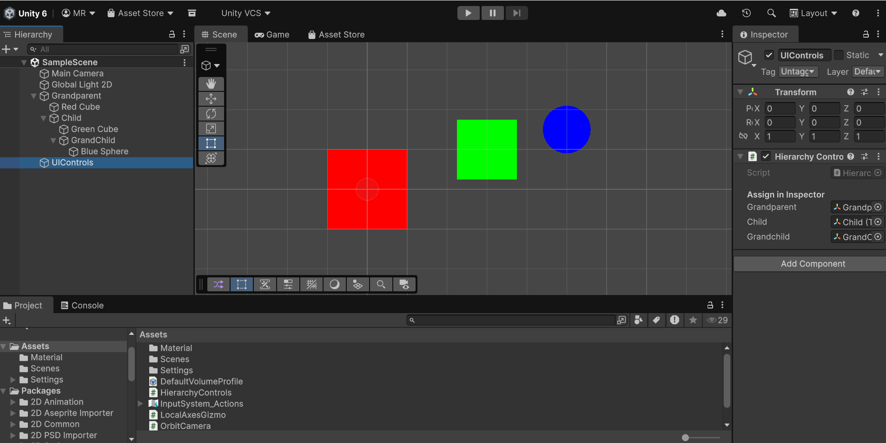
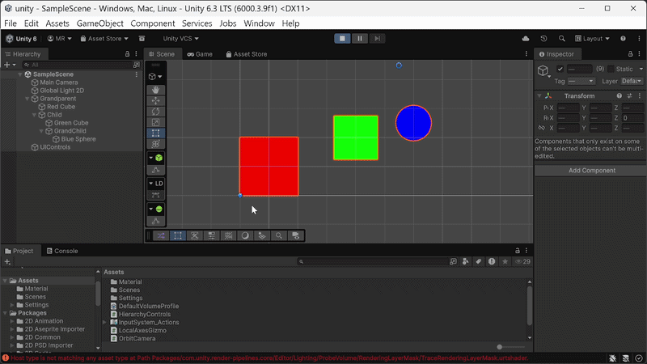
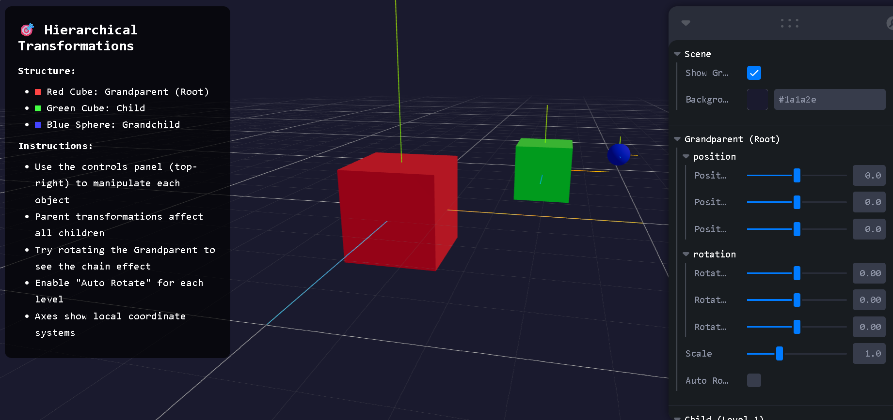
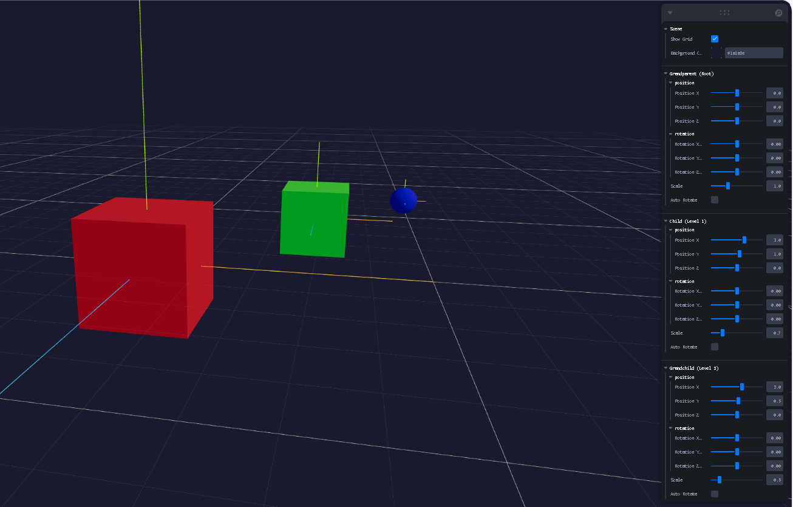
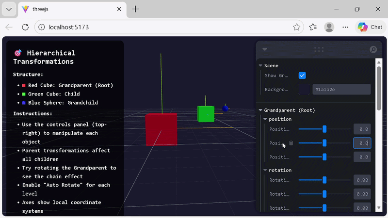

# Taller Jerarquias Transformaciones

**Estudiante:** Maicol Sebastian Olarte Ramirez  
**Fecha de entrega:** 21 de Febrero, 2026

---

## 📋 Descripción

Este taller implementa jerarquías de transformaciones utilizando sistemas padre-hijo en Unity y Three.js. El objetivo es comprender cómo las transformaciones de objetos padres afectan automáticamente a todos sus descendientes, creando estructuras jerárquicas útiles para robots, sistemas solares, personajes articulados, y modelos complejos.

Se desarrollaron dos implementaciones completas:
- **Unity (C#)**: Jerarquía de 3 niveles con GUI interactiva usando OnGUI legacy system
- **Three.js (React)**: Jerarquía de 3 niveles con controles Leva y ejes locales visualizados

**Conceptos clave:**
- Transformaciones locales vs. globales
- Propagación de transformaciones en cadenas jerárquicas
- Sistemas de coordenadas locales
- Auto-rotación independiente por nivel

---

## 🛠️ Implementaciones

### 1. Entorno Unity (C#)

**Scripts desarrollados:**

#### 📄 `HierarchyControls.cs` (Script principal - 132 líneas)
Panel de control GUI con sliders para manipular una jerarquía de 3 objetos:

**Funcionalidades:**
- **Control de 3 niveles jerárquicos:**
  - 🔴 **Grandparent (Root)**: Cubo rojo grande en el nivel raíz
  - 🟢 **Child (Level 1)**: Cubo verde mediano, hijo del Grandparent
  - 🔵 **Grandchild (Level 2)**: Esfera azul pequeña, hijo del Child

- **Controles por objeto:**
  - Rotación en ejes X, Y, Z con sliders (-180° a 180°)
  - Posición en ejes X, Y con sliders (-10 a 10 unidades)
  - Toggle de auto-rotación independiente
  - Visualización en tiempo real de valores

- **Panel GUI legacy (OnGUI):**
  - 3 paneles coloreados según el objeto (rojo, verde, azul)
  - Sliders horizontales para control preciso
  - Labels con valores numéricos actualizados
  - Checkboxes para auto-rotación

**Velocidades de auto-rotación:**
- Grandparent: 50°/s en eje Y
- Child: 80°/s en eje Z
- Grandchild: 120°/s en eje X

#### 📄 `LocalAxesGizmo.cs` (19 líneas)
Visualizador de ejes locales en Scene view usando Gizmos:

```csharp
void OnDrawGizmos()
{
    Gizmos.color = Color.red;
    Gizmos.DrawRay(transform.position, transform.right * length);   // X
    
    Gizmos.color = Color.green;
    Gizmos.DrawRay(transform.position, transform.up * length);      // Y
    
    Gizmos.color = Color.blue;
    Gizmos.DrawRay(transform.position, transform.forward * length); // Z
}
```

**Utilidad:** Mostrar orientación de sistemas de coordenadas locales en editor

#### 📄 `OrbitCamera.cs` (24 líneas)
Cámara orbital simple para navegar la escena:

**Controles:**
- Click derecho + drag: Rotar cámara alrededor del target
- Mouse X/Y: Control de yaw y pitch
- Clamp de pitch: -80° a 80° para evitar gimbal lock
- Distancia fija configurable

#### 📄 `TransformController.cs` (17 líneas)
Script auxiliar genérico para auto-rotación:

**Parámetros:**
- `autoRotate`: bool para activar/desactivar
- `rotationSpeed`: Vector3 para velocidad en cada eje
- `Space.Self`: Rotación en espacio local

**Características Unity:**
- Uso de `localPosition` y `localEulerAngles` para transformaciones relativas al padre
- Inspector público para asignar referencias de GameObjects
- Sistema de jerarquía nativo de Unity (Transform parent-child)
- Gizmos para visualización en Scene view

---

### 2. Entorno Three.js (React + Vite)

**Archivo:** `threejs/src/HierarchyScene.jsx` (257 líneas)

Escena interactiva con jerarquía de 3 niveles usando React Three Fiber.

**Stack tecnológico:**
- **React 19.2.0**: Framework UI
- **Three.js 0.183.0**: Motor 3D
- **React Three Fiber 9.5.0**: Renderer declarativo para Three.js
- **@react-three/drei 10.7.7**: Helpers (OrbitControls, Grid)
- **Leva 0.10.1**: Panel GUI para controles
- **Vite 7.3.1**: Build tool

**Estructura de componentes:**

#### 🎯 Componente `Grandparent` (Root)
```jsx
<group ref={groupRef}>
  {/* Visual: Cubo rojo 2×2×2 */}
  <mesh>
    <boxGeometry args={[2, 2, 2]} />
    <meshStandardMaterial color="#ff4444" />
  </mesh>
  
  {/* Ejes locales */}
  <axesHelper args={[2.5]} />
  
  {/* Hijo anidado */}
  <Child />
</group>
```

**Controles (Leva panel):**
- Position X/Y/Z: -10 a 10, step 0.1
- Rotation X/Y/Z: -π a π radianes, step 0.01
- Scale: 0.1 a 3, step 0.1
- Auto Rotate: toggle (velocidad 0.5 rad/s en eje Y)

#### 🎯 Componente `Child` (Level 1)
```jsx
<group ref={groupRef}>
  {/* Visual: Cubo verde 1.5×1.5×1.5 */}
  <mesh>
    <boxGeometry args={[1.5, 1.5, 1.5]} />
    <meshStandardMaterial color="#44ff44" />
  </mesh>
  
  <axesHelper args={[1.8]} />
  <Grandchild />
</group>
```

**Posición relativa default:** (3, 1, 0) respecto al Grandparent  
**Auto-rotate:** 0.8 rad/s en eje Z

#### 🎯 Componente `Grandchild` (Level 2)
```jsx
<group ref={groupRef}>
  {/* Visual: Esfera azul radio 0.6 */}
  <mesh>
    <sphereGeometry args={[0.6, 32, 32]} />
    <meshStandardMaterial color="#4444ff" />
  </mesh>
  
  <axesHelper args={[1]} />
</group>
```

**Posición relativa default:** (2, 0.5, 0) respecto al Child  
**Auto-rotate:** 1.2 rad/s en eje X

#### 🌍 Escena principal
**Iluminación:**
- Ambient light: intensidad 0.5
- Directional light: posición (10, 10, 5), intensidad 1
- Point light: posición (-10, -10, -5), intensidad 0.5

**Ayudas visuales:**
- Grid infinito 20×20 con celdas de 1 unidad
- Ejes globales (axesHelper) de 5 unidades
- Ejes locales por objeto (rojo=X, verde=Y, azul=Z)

**Overlay de instrucciones:**
- Panel flotante en esquina superior izquierda
- Estructura jerárquica explicada con colores
- Instrucciones de uso
- Fondo semi-transparente

**Características Three.js:**
- Uso de `<group>` para crear jerarquías (equivalente a GameObject vacío en Unity)
- `useFrame` hook para animaciones en tiempo real
- `useEffect` para sincronizar controles con transformaciones
- `useRef` para referencias estables a objetos 3D
- OrbitControls para navegación de cámara

---

## 📸 Resultados Visuales

### Implementación Unity


*Jerarquía de 3 niveles en Unity con panel GUI de controles y ejes locales visibles*


*Auto-rotación en los 3 niveles demostrando propagación de transformaciones*

### Implementación Three.js


*Escena Three.js con cubo rojo (root), cubo verde (child) y esfera azul (grandchild)*


*Panel Leva con controles para cada nivel de la jerarquía*


*Transformaciones propagándose desde el padre hacia los hijos con ejes locales visibles*

---

## 💻 Código Relevante

### Unity - Aplicación de transformaciones locales

```csharp
void Update()
{
    // Aplicar rotaciones en espacio local
    grandparent.localEulerAngles = gpRot;
    child.localEulerAngles       = childRot;
    grandchild.localEulerAngles  = gcRot;

    // Aplicar posiciones relativas al padre
    grandparent.localPosition = gpPos;
    child.localPosition       = childPos;
    grandchild.localPosition  = gcPos;

    // Auto-rotación independiente
    if (gpAuto)    gpRot.y    += Time.deltaTime * 50f;
    if (childAuto) childRot.z += Time.deltaTime * 80f;
    if (gcAuto)    gcRot.x    += Time.deltaTime * 120f;
}
```

**Clave:** `localPosition` y `localEulerAngles` aseguran que las transformaciones sean relativas al padre, no al mundo.

### Unity - GUI con sliders

```csharp
void OnGUI()
{
    // Panel para Grandparent
    GUI.color = new Color(1f, 0.3f, 0.3f, 0.95f);
    GUI.Box(new Rect(x, 10, panelW, 200), "");
    GUI.color = Color.white;
    
    GUI.Label(new Rect(x+10, 15, panelW, 20), "🔴 GRANDPARENT (Root)", title);
    
    // Slider de rotación
    GUI.Label(new Rect(x+10, 40, 100, 20), "Rot Y:");
    gpRot.y = GUI.HorizontalSlider(new Rect(x+80, 45, 180, 15), gpRot.y, -180f, 180f);
    GUI.Label(new Rect(x+265, 40, 50, 20), Mathf.RoundToInt(gpRot.y) + "°");
    
    // Toggle de auto-rotación
    GUI.Label(new Rect(x+10, 145, 150, 20), "Auto Rotate:");
    gpAuto = GUI.Toggle(new Rect(x+130, 145, 20, 20), gpAuto, "");
}
```

### Unity - Gizmos para ejes locales

```csharp
void OnDrawGizmos()
{
    Gizmos.color = Color.red;
    Gizmos.DrawRay(transform.position, transform.right * length);

    Gizmos.color = Color.green;
    Gizmos.DrawRay(transform.position, transform.up * length);

    Gizmos.color = Color.blue;
    Gizmos.DrawRay(transform.position, transform.forward * length);
}
```

### Three.js - Jerarquía anidada con groups

```jsx
function Grandparent() {
  const groupRef = useRef()
  const controls = useControls('Grandparent (Root)', { /* ... */ })
  
  useFrame((state, delta) => {
    if (controls.autoRotate && groupRef.current) {
      groupRef.current.rotation.y += delta * 0.5
    }
  })
  
  useEffect(() => {
    if (groupRef.current) {
      // Aplicar transformaciones desde controles
      groupRef.current.position.set(controls.posX, controls.posY, controls.posZ)
      groupRef.current.rotation.set(controls.rotX, controls.rotY, controls.rotZ)
      groupRef.current.scale.setScalar(controls.scale)
    }
  }, [controls])
  
  return (
    <group ref={groupRef}>
      <mesh>
        <boxGeometry args={[2, 2, 2]} />
        <meshStandardMaterial color="#ff4444" />
      </mesh>
      <axesHelper args={[2.5]} />
      
      {/* Child anidado heredará todas las transformaciones */}
      <Child />
    </group>
  )
}
```

**Clave:** El componente `<Child />` está anidado dentro del `<group>`, por lo que automáticamente hereda todas las transformaciones del padre.

### Three.js - Configuración de controles Leva

```jsx
const controls = useControls('Grandparent (Root)', {
  position: folder({
    posX: { value: 0, min: -10, max: 10, step: 0.1, label: 'Position X' },
    posY: { value: 0, min: -10, max: 10, step: 0.1, label: 'Position Y' },
    posZ: { value: 0, min: -10, max: 10, step: 0.1, label: 'Position Z' },
  }),
  rotation: folder({
    rotX: { value: 0, min: -Math.PI, max: Math.PI, step: 0.01, label: 'Rotation X (rad)' },
    rotY: { value: 0, min: -Math.PI, max: Math.PI, step: 0.01, label: 'Rotation Y (rad)' },
    rotZ: { value: 0, min: -Math.PI, max: Math.PI, step: 0.01, label: 'Rotation Z (rad)' },
  }),
  scale: { value: 1, min: 0.1, max: 3, step: 0.1, label: 'Scale' },
  autoRotate: { value: false, label: 'Auto Rotate' }
})
```

---

## 🤖 Prompts Utilizados (IA Generativa)

Durante el desarrollo se utilizó GitHub Copilot con los siguientes prompts:

### Unity Implementation

1. **"Create Unity hierarchy with 3 levels: grandparent (red cube), child (green cube), grandchild (blue sphere)"**
   - Configuró jerarquía en escena con GameObjects anidados

2. **"Create HierarchyControls script with OnGUI sliders for position, rotation and auto-rotate for each level"**
   - Generó script con panel GUI completo y 3 secciones coloreadas

3. **"Add LocalAxesGizmo script to show local coordinate systems in Scene view"**
   - Implementó Gizmos.DrawRay para visualizar ejes RGB

4. **"Create OrbitCamera script with right-click drag to rotate around target"**
   - Script de cámara orbital con control de mouse y clamp de pitch

### Three.js Implementation

5. **"Create React Three Fiber scene with 3-level hierarchy using groups: Grandparent, Child, Grandchild"**
   - Estructura de componentes anidados con `<group>`

6. **"Add Leva controls for each level with position, rotation, scale and auto-rotate"**
   - Panel completo con folders organizados por nivel jerárquico

7. **"Add axesHelper to each object to visualize local coordinate systems"**
   - `<axesHelper>` con tamaños proporcionales por nivel

8. **"Add overlay with instructions explaining the hierarchy structure and colors"**
   - Panel flotante con estructura explicada y controles documentados

9. **"Add Grid, lights, and OrbitControls for better visualization"**
   - Iluminación triple, grid infinito y navegación de cámara

---

## 📚 Aprendizajes y Dificultades

### Implementación Unity

**Aprendizajes:**

- **Sistema de jerarquía nativo:** Unity maneja automáticamente la propagación de transformaciones padre-hijo
- **Transformaciones locales vs globales:**
  - `transform.localPosition`: Posición relativa al padre
  - `transform.position`: Posición absoluta en el mundo
  - `transform.localEulerAngles`: Rotación relativa
  - `transform.eulerAngles`: Rotación absoluta
- **OnGUI legacy system:** Aunque obsoleto, útil para prototipos rápidos sin configurar UI Canvas
- **Gizmos:** Herramienta poderosa para debugging visual en Scene view (no se ven en Game view)
- **Space.Self vs Space.World:** `transform.Rotate(vector, Space.Self)` rota en ejes locales

**Dificultades:**

1. **OnGUI layout manual**
   - **Problema:** Calcular posiciones pixel-perfectas para cada elemento GUI
   - **Solución:** Variables para dimensiones base (panelW, x) y offsets calculados

2. **Actualización de transformaciones en Update()**
   - **Problema:** Asignar valores cada frame vs. aplicar solo cuando cambian
   - **Decisión:** Asignar siempre en Update() para simplificar lógica (overhead mínimo)

3. **Gizmos no visibles en Game view**
   - **Problema:** Ejes locales solo se ven en Scene view del editor
   - **Solución:** Documentar diferencia entre Gizmos (editor) y debug rendering (runtime)

4. **Referencias null en Inspector**
   - **Problema:** Olvidar asignar referencias de grandparent/child/grandchild
   - **Solución:** Header y comentarios claros en script

**Mejores prácticas aprendidas:**
- Usar `localPosition` y `localEulerAngles` para jerarquías
- OnGUI es simple pero no escalable (preferir UI Toolkit o Canvas)
- Gizmos para debug, LineRenderer para runtime visualization
- Configurar jerarquía en Inspector antes de Play

---

### Implementación Three.js

**Aprendizajes:**

- **`<group>` como contenedor jerárquico:** Equivalente a Empty GameObject en Unity
- **Anidamiento de componentes:** JSX permite expresar jerarquías naturalmente
- **useRef + useFrame:** Patrón para animaciones en React Three Fiber
- **useEffect para sincronización:** Aplicar valores de controles a objetos 3D
- **axesHelper:** Visualizador de ejes integrado en Three.js (rojo=X, verde=Y, azul=Z)
- **Propagación automática:** Transformaciones del padre afectan todo el subárbol sin código adicional
- **Leva folders:** Organización limpia de muchos controles en categorías

**Dificultades:**

1. **Sincronización de controles con transformaciones**
   - **Problema:** Cambios en Leva no se reflejaban inmediatamente en objetos
   - **Solución:** useEffect con dependencias en controles para aplicar valores cuando cambian

2. **Auto-rotación + controles manuales**
   - **Problema:** Auto-rotate sobreescribía rotación manual
   - **Solución:** useFrame modifica solo el eje específico, controles actualizan en useEffect

3. **Referencias a grupos anidados**
   - **Problema:** Cada componente necesita su propio ref, no compartir refs entre niveles
   - **Solución:** useRef() individual en cada componente (Grandparent, Child, Grandchild)

4. **Nombres de controles únicos en Leva**
   - **Problema:** Si dos `useControls()` tienen el mismo nombre de panel, se combinan
   - **Solución:** Nombres únicos descriptivos: 'Grandparent (Root)', 'Child (Level 1)', etc.

5. **Tamaños de ejes proporcionales**
   - **Problema:** Todos los ejes del mismo tamaño causaban confusión visual
   - **Solución:** Escalar tamaños: Grandparent=2.5, Child=1.8, Grandchild=1.0

**Mejores prácticas aprendidas:**
- Anidar componentes jerárquicamente para modelar relaciones padre-hijo
- useRef para referencias estables a objetos 3D
- useEffect con dependencias específicas para sincronización reactiva
- Folders en Leva para organizar muchos controles
- axesHelper en cada grupo para debugging de orientación
- Nombres claros y descriptivos para paneles de control

**Conceptos de jerarquías aplicados:**
- **Compound transformations:** Transformación total = Parent × Local
- **Local vs global space:** Herramientas trabajan en espacio local, resultado en global
- **Scene graph:** Estructura de árbol donde cada nodo tiene transformación acumulativa
- **Gimbal lock:** Rotaciones Euler pueden tener singularidades (cuidado con orden)

---

## 🚀 Ejecución

### Unity
1. Abrir proyecto en Unity Editor (versión 2021.3 o superior)
2. Abrir escena: `Assets/Scenes/HierarchyScene.unity`
3. En Hierarchy, seleccionar GameObject "HierarchyController"
4. En Inspector, asignar referencias:
   - **Grandparent:** GameObject "Grandparent"
   - **Child:** GameObject "Child"
   - **Grandchild:** GameObject "Grandchild"
5. Presionar **Play**
6. Usar sliders en Game view para manipular transformaciones
7. Habilitar auto-rotate para ver propagación animada

**Controles:**
- Click derecho + drag en Game view: Rotar cámara
- Sliders GUI: Controlar posición/rotación por nivel
- Checkboxes: Activar auto-rotación independiente

### Three.js
```bash
cd threejs
npm install
npm run dev
```

Abrir navegador en **http://localhost:5173**

**Usar la aplicación:**
1. Panel Leva aparece en esquina superior derecha
2. Expandir folders: "Grandparent (Root)", "Child (Level 1)", "Grandchild (Level 2)"
3. Ajustar sliders de Position, Rotation, Scale
4. Activar "Auto Rotate" para animación continua
5. Usar mouse para OrbitControls:
   - Click izquierdo + drag: Rotar cámara
   - Click derecho + drag: Pan
   - Scroll: Zoom
6. Observar ejes locales (RGB) en cada objeto
7. Ver propagación de transformaciones en tiempo real

---

## 📁 Estructura del Proyecto

```
semana_1_3_jerarquias_transformaciones/
├── README.md                                # Este archivo
├── media/                                   # Evidencias visuales (PENDIENTE)
│   ├── unity_hierarchy.png
│   ├── unity_rotation.gif
│   ├── threejs_hierarchy.png
│   ├── threejs_controls.png
│   └── threejs_hierarchy.gif
├── unity/
│   ├── Assets/
│   │   ├── HierarchyControls.cs            # Script principal (132 líneas)
│   │   ├── LocalAxesGizmo.cs               # Visualización de ejes (19 líneas)
│   │   ├── OrbitCamera.cs                  # Cámara orbital (24 líneas)
│   │   ├── TransformController.cs          # Auto-rotación genérica (17 líneas)
│   │   └── Scenes/
│   │       └── HierarchyScene.unity        # Escena con jerarquía configurada
│   ├── ProjectSettings/
│   └── Packages/
└── threejs/
    ├── src/
    │   ├── HierarchyScene.jsx              # Componente principal (257 líneas)
    │   ├── App.jsx                         # App wrapper
    │   ├── App.css                         # Estilos globales
    │   ├── index.css                       # Reset CSS
    │   └── main.jsx                        # Entry point
    ├── public/
    ├── index.html
    ├── package.json
    ├── vite.config.js
    └── eslint.config.js
```

---

## 📖 Referencias

**Conceptos de jerarquías:**
- [Unity Transform Hierarchy](https://docs.unity3d.com/Manual/class-Transform.html)
- [Scene Graph - Wikipedia](https://en.wikipedia.org/wiki/Scene_graph)
- [Three.js Object3D Hierarchy](https://threejs.org/docs/#api/en/core/Object3D)

**Unity:**
- [Transform Component](https://docs.unity3d.com/ScriptReference/Transform.html)
- [OnGUI Documentation](https://docs.unity3d.com/ScriptReference/MonoBehaviour.OnGUI.html)
- [Gizmos Class](https://docs.unity3d.com/ScriptReference/Gizmos.html)

**Three.js:**
- [React Three Fiber Docs](https://docs.pmnd.rs/react-three-fiber/)
- [Three.js Group](https://threejs.org/docs/#api/en/objects/Group)
- [Leva Controls](https://github.com/pmndrs/leva)
- [@react-three/drei](https://github.com/pmndrs/drei)

---

## 🎓 Conceptos Clave

### Transformaciones Jerárquicas

**Relación Padre-Hijo:**
```
World_Transform(Child) = World_Transform(Parent) × Local_Transform(Child)
```

**Ejemplo con 3 niveles:**
```
Grandchild_World = Grandparent_World × Child_Local × Grandchild_Local
```

**Consecuencias:**
1. Si el padre rota, todos los hijos rotan con él (mantienen su posición relativa)
2. Si el padre escala, los hijos se escalan proporcionalmente
3. Si el padre se traslada, los hijos se mueven junto con él

### Espacios de Coordenadas

**Local Space (Object Space):**
- Relativo al padre inmediato
- Origen en el pivot del padre
- Unity: `localPosition`, `localRotation`, `localScale`
- Three.js: valores dentro del `<group>` padre

**World Space (Global Space):**
- Relativo al origen del mundo
- Unity: `position`, `rotation`, `lossyScale`
- Three.js: `getWorldPosition()`, `getWorldQuaternion()`

**Parent Space:**
- Espacio local del padre = world space de los hijos directos

### Orden de Transformaciones

Dentro de un objeto:
```
Final = Translation × Rotation × Scale (TRS)
```

En jerarquía:
```
Grandchild = GP_Matrix × Child_Matrix × GC_Matrix
```

Aplicación: **derecha a izquierda** (primero escala, luego rota, finalmente traslada)

---

## ✅ Checklist de Entrega

- [x] Implementación Unity con 4 scripts C#
- [x] Implementación Three.js con jerarquía de 3 niveles
- [x] README.md completo con todas las secciones requeridas
- [x] Código limpio y bien comentado
- [ ] Capturas de pantalla y GIFs en `media/` ⚠️
- [x] Commits descriptivos en inglés
- [x] Carpeta nombrada correctamente: `semana_1_3_jerarquias_transformaciones`
- [x] Estructura de directorios correcta (unity/, threejs/, media/)

---

## 🔍 Diferencias Unity vs Three.js

| Aspecto | Unity | Three.js |
|---------|-------|----------|
| **Jerarquía** | Transform parent-child | `<group>` anidados |
| **Espacio local** | `localPosition/Rotation/Scale` | Posición dentro del group |
| **GUI** | OnGUI / UI Canvas | Leva / HTML overlay |
| **Ejes locales** | Gizmos (editor only) | axesHelper (runtime) |
| **Animación** | Update() + Time.deltaTime | useFrame() + delta |
| **Controles** | Sliders manuales | Hooks reactivos |
| **Visualización** | Scene + Game view | Canvas único |

**Similitudes:**
- Ambos usan matrices 4×4 internamente
- Propagación automática de transformaciones
- Sistemas de coordenadas locales por objeto
- Orden TRS para transformaciones

---

**Autor:** Maicol Sebastian Olarte Ramirez  
**Curso:** Visual Computing 2026-I  
**Universidad Nacional de Colombia**
