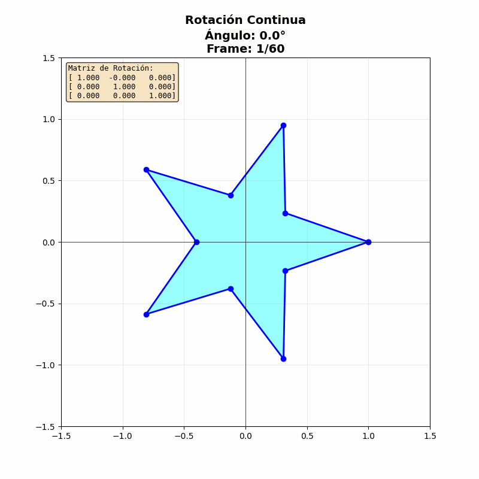
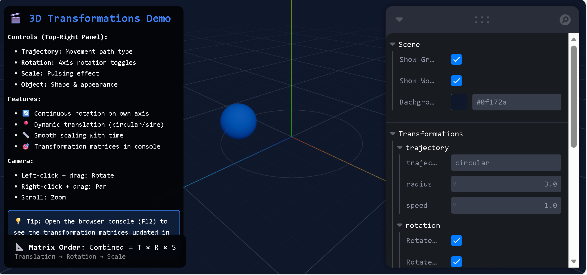
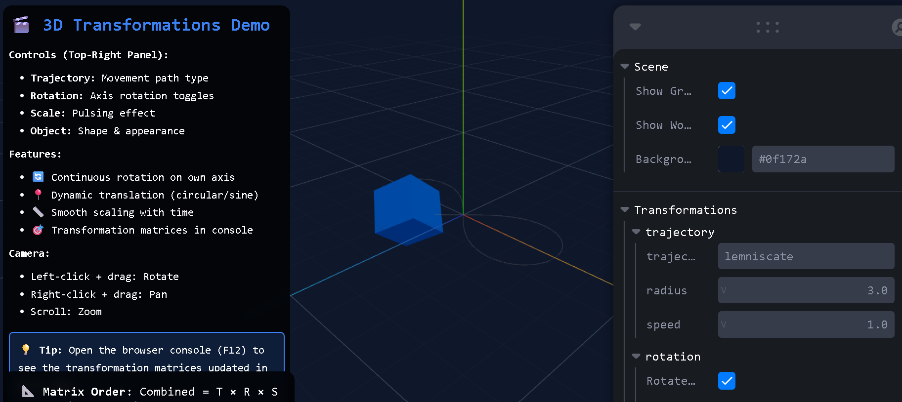
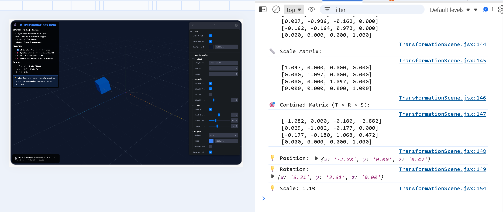
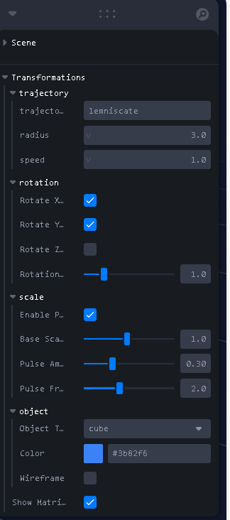

# Taller Transformaciones

**Estudiante:** Maicol Sebastian Olarte Ramirez  
**Fecha de entrega:** 21 de Febrero, 2026

---

## 📋 Descripción

Este taller implementa transformaciones geométricas 2D y 3D utilizando matrices de transformación en múltiples entornos de desarrollo. El objetivo es comprender cómo las matrices de traslación, rotación y escala pueden combinarse para crear animaciones complejas, y visualizar estos conceptos tanto en Python (2D) como en Three.js (3D).

Se desarrollaron dos implementaciones completas:
- **Python (Jupyter):** Transformaciones 2D con matrices 3×3 en coordenadas homogéneas, generando animaciones exportadas como GIF
- **Three.js (React):** Transformaciones 3D con matrices 4×4, animaciones en tiempo real y controles interactivos

---

## 🛠️ Implementaciones

### 1. Entorno Python (Jupyter Notebook)

**Archivo:** `python/transformaciones_2d.ipynb`

Demostración educativa de transformaciones 2D usando álgebra lineal y visualización con matplotlib.

**Bibliotecas utilizadas:**
- **numpy**: Operaciones matriciales y cálculos numéricos
- **matplotlib**: Renderizado de figuras 2D para cada frame
- **imageio**: Exportación de animaciones como GIF
- **IPython.display**: Visualización de GIFs en notebooks

**Funcionalidades implementadas:**
- **Matrices de transformación en coordenadas homogéneas (3×3)**
  - `translation_matrix(tx, ty)`: Traslación en el plano XY
  - `rotation_matrix(angle)`: Rotación alrededor del origen
  - `scale_matrix(sx, sy)`: Escalado en X e Y
  - `apply_transformation(points, matrix)`: Aplicación de transformaciones

- **Figuras 2D vectoriales**
  - Estrella de 5 puntas creada con coordenadas polares
  - Triángulo equilátero para trayectorias complejas
  - Representación en coordenadas homogéneas para operaciones matriciales

- **Tres animaciones exportadas como GIF:**
  1. **Rotación continua (60 frames, 20 fps)**: Estrella rotando 360° con matriz de rotación visible
  2. **Transformación combinada (80 frames, 24 fps)**: Trayectoria circular con rotación 3× más rápida y escala pulsante
  3. **Movimiento senoidal (100 frames, 25 fps)**: Triángulo siguiendo onda seno con rotación tangente a la trayectoria

- **Visualización de matrices**
  - Matrices impresas en cada frame con formato 3×3
  - Parámetros de transformación mostrados en tiempo real
  - Trayectorias completas dibujadas con alpha para contexto visual

**Orden de transformaciones:** T × R × S (Traslación × Rotación × Escala)

---

### 2. Entorno Three.js (React + Vite)

**Directorio:** `threejs/`

Visualizador 3D interactivo con transformaciones animadas y control total sobre los parámetros.

**Stack tecnológico:**
- **React 19.2.0**: Framework UI con hooks
- **Three.js**: Motor de renderizado 3D con WebGL
- **React Three Fiber (R3F)**: Renderer declarativo para Three.js
- **@react-three/drei**: Componentes útiles (OrbitControls, Grid)
- **Leva**: Panel GUI para controles en tiempo real
- **Vite 7.3.1**: Build tool y dev server ultrarrápido

**Características principales:**

#### 🎯 Sistema de transformaciones animadas
- **Traslación con 4 tipos de trayectoria:**
  - `circular`: Movimiento en círculo usando `cos(t)` y `sin(t)`
  - `sinusoidal`: Onda seno con desplazamiento lineal
  - `lemniscate`: Figura-8 (lemniscata de Gerono)
  - `none`: Sin movimiento, posición fija

- **Rotación independiente por eje:**
  - Rotación X, Y, Z activables individualmente
  - Velocidad configurable (0-5×)
  - Matrices de rotación combinadas usando `makeRotationFromEuler()`

- **Escala pulsante:**
  - Base scale configurable (0.1-2.0)
  - Amplitud de pulsación (0-1.0)
  - Frecuencia ajustable (0.1-5.0 Hz)
  - Fórmula: `scale = base + sin(time × frequency) × amplitude`

#### 📐 Visualización de matrices 4×4
Las matrices se calculan con `THREE.Matrix4` y se muestran en consola del navegador cada 2 segundos:
- **Translation Matrix**: Matriz de traslación pura
- **Rotation Matrix**: Matriz de rotación compuesta
- **Scale Matrix**: Matriz de escalado uniforme
- **Combined Matrix**: T × R × S (orden de aplicación)

Formato de salida:
```
=== TRANSFORMATION MATRICES ===
Time: 12.34 s

📍 Translation Matrix:
[1.000, 0.000, 0.000, 2.456]
[0.000, 1.000, 0.000, 0.000]
[0.000, 0.000, 1.000, 1.789]
[0.000, 0.000, 0.000, 1.000]
```

#### 🎮 Panel de controles interactivos (Leva)
- **Trajectory folder**: Tipo, radio (0-5), velocidad (0-5×)
- **Rotation folder**: Toggle por eje (X/Y/Z), velocidad de rotación
- **Scale folder**: Escala base, amplitud y frecuencia de pulsación
- **Object folder**: Tipo (esfera/cubo), color picker, modo wireframe
- **showMatrices toggle**: Activar/desactivar logging de matrices

#### 🎥 Controles de cámara (OrbitControls)
- Click izquierdo + drag: Rotar alrededor del objeto
- Click derecho + drag: Pan (desplazamiento)
- Scroll: Zoom in/out
- Damping habilitado para movimientos suaves

#### 🌍 Ayudas visuales
- **Grid**: Plano de referencia con líneas cada 1 unidad
- **Trail effect**: Línea fantasma mostrando la trayectoria completa
- **Iluminación**: Luz ambiental + luz direccional para profundidad

**Optimizaciones implementadas:**
- Cálculo de matrices en cada frame usando `useFrame` hook
- Referencias estables con `useRef` para evitar re-renders
- Dispose correcto de recursos (sin memory leaks)
- Formato de números en consola con `.toFixed(3)` para legibilidad

---

## 📸 Resultados Visuales

### Implementación Python


*Animación 1: Estrella rotando 360° mostrando matriz de rotación en cada frame (60 frames, 3 segundos)*


*Animación 2: Trayectoria circular con rotación triple y escala pulsante - demuestra T×R×S (80 frames, 3.3 segundos)*


*Animación 3: Triángulo siguiendo onda seno con rotación tangente a la trayectoria (100 frames, 4 segundos)*

> **Nota:** Los GIFs se generan automáticamente al ejecutar el notebook y se guardan en la carpeta `media/`

### Implementación Three.js


*Vista de esfera en trayectoria circular con trail effect y panel de controles Leva*


*Cubo en trayectoria lemniscate (figura-8) con rotación en múltiples ejes y escala pulsante*


*Matrices 4×4 mostradas en consola del navegador con actualización cada 2 segundos*


*Panel Leva con todos los controles organizados en folders (Trajectory, Rotation, Scale, Object)*


---

## 💻 Código Relevante

### Python - Matrices de transformación 2D

```python
import numpy as np

def translation_matrix(tx, ty):
    """Matriz de traslación 2D en coordenadas homogéneas"""
    return np.array([
        [1, 0, tx],
        [0, 1, ty],
        [0, 0, 1]
    ])

def rotation_matrix(angle):
    """Matriz de rotación 2D (ángulo en radianes)"""
    cos_a, sin_a = np.cos(angle), np.sin(angle)
    return np.array([
        [cos_a, -sin_a, 0],
        [sin_a,  cos_a, 0],
        [   0,      0,  1]
    ])

def scale_matrix(sx, sy):
    """Matriz de escala 2D"""
    return np.array([
        [sx,  0, 0],
        [ 0, sy, 0],
        [ 0,  0, 1]
    ])

# Composición de transformaciones (orden: T × R × S)
T = translation_matrix(tx, ty)
R = rotation_matrix(angle)
S = scale_matrix(scale_factor, scale_factor)
M = T @ R @ S  # @ es el operador de multiplicación matricial en NumPy

# Aplicar a puntos (coordenadas homogéneas)
transformed = apply_transformation(points, M)
```

### Python - Generación de animación GIF

```python
import matplotlib.pyplot as plt
import imageio

frames = []
n_frames = 60

for frame in range(n_frames):
    fig, ax = plt.subplots(figsize=(8, 8))
    
    # Calcular transformación
    angle = 2 * np.pi * frame / n_frames
    R = rotation_matrix(angle)
    star_rotated = apply_transformation(star, R)
    
    # Dibujar
    ax.plot(star_rotated[0, :], star_rotated[1, :], 'b-o')
    ax.fill(star_rotated[0, :], star_rotated[1, :], alpha=0.4)
    
    # Convertir figura a imagen (compatible con matplotlib 3.8+)
    fig.canvas.draw()
    buf = fig.canvas.buffer_rgba()
    image = np.asarray(buf)[:, :, :3]  # RGBA → RGB
    frames.append(image)
    plt.close()

# Guardar como GIF
imageio.mimsave('rotation_animation.gif', frames, fps=20)
```

### Three.js - Transformaciones con useFrame

```javascript
import { useRef } from 'react'
import { useFrame } from '@react-three/fiber'
import * as THREE from 'three'

function AnimatedObject() {
  const meshRef = useRef()
  const matrixRef = useRef({
    translation: new THREE.Matrix4(),
    rotation: new THREE.Matrix4(),
    scale: new THREE.Matrix4(),
    combined: new THREE.Matrix4()
  })
  
  useFrame((state, delta) => {
    const time = state.clock.elapsedTime
    
    // Traslación: trayectoria circular
    const x = radius * Math.cos(time)
    const z = radius * Math.sin(time)
    meshRef.current.position.set(x, 0, z)
    matrixRef.current.translation.makeTranslation(x, 0, z)
    
    // Rotación: múltiples ejes
    meshRef.current.rotation.x += delta * rotSpeed
    meshRef.current.rotation.y += delta * rotSpeed
    matrixRef.current.rotation.makeRotationFromEuler(meshRef.current.rotation)
    
    // Escala: pulsante
    const scaleValue = baseScale + Math.sin(time * frequency) * amplitude
    meshRef.current.scale.setScalar(scaleValue)
    matrixRef.current.scale.makeScale(scaleValue, scaleValue, scaleValue)
    
    // Matriz combinada (T × R × S)
    matrixRef.current.combined.identity()
    matrixRef.current.combined.multiply(matrixRef.current.translation)
    matrixRef.current.combined.multiply(matrixRef.current.rotation)
    matrixRef.current.combined.multiply(matrixRef.current.scale)
  })
  
  return <mesh ref={meshRef}>...</mesh>
}
```

### Three.js - Leva controls configuration

```javascript
import { useControls, folder } from 'leva'

const controls = useControls('Transformations', {
  trajectory: folder({
    trajectoryType: {
      value: 'circular',
      options: ['circular', 'sinusoidal', 'lemniscate', 'none'],
      label: 'Trajectory Type'
    },
    radius: { value: 3, min: 0, max: 5, step: 0.1 },
    speed: { value: 1, min: 0, max: 5, step: 0.1 }
  }),
  rotation: folder({
    rotateX: { value: true, label: 'Rotate X-axis' },
    rotateY: { value: true, label: 'Rotate Y-axis' },
    rotateZ: { value: false, label: 'Rotate Z-axis' },
    rotationSpeed: { value: 1, min: 0, max: 5, step: 0.1 }
  }),
  scale: folder({
    enablePulse: { value: true },
    baseScale: { value: 1, min: 0.1, max: 2, step: 0.1 },
    pulseAmplitude: { value: 0.3, min: 0, max: 1, step: 0.05 },
    pulseFrequency: { value: 2, min: 0.1, max: 5, step: 0.1 }
  })
})
```

---

## 🤖 Prompts Utilizados (IA Generativa)

Durante el desarrollo se utilizó GitHub Copilot con los siguientes prompts clave:

### Python Implementation

1. **"implement the next requiriments, first in python folder: Create figura 2D, Apply transformations using matrices, Generate animation, Export as GIF"**
   - Generó notebook inicial con matrices de transformación y estructura de animaciones

2. **"there is erros like AttributeError: 'FigureCanvasAgg' object has no attribute 'tostring_rgb'"**
   - Solucionó incompatibilidad con matplotlib 3.8+ reemplazando `tostring_rgb()` con `buffer_rgba()`

3. **"animations are image only I don't what's the reason because these don't play"**
   - Cambió método de display de GIFs de `Image(filename=...)` a `Image(data=f.read(), format='gif')`
   - Creó función helper `show_gif()` usando HTML para mejor compatibilidad con VS Code

4. **"Clean duplicate sections and optimize notebook structure"**
   - Script Python para remover 25 celdas duplicadas (56→31 celdas)
   - Consolidó código repetido y mejoró organización

### Three.js Implementation

5. **"Now in threejs folder: Create project with Vite and React Three Fiber, Add 3D object, Apply animations with useFrame"**
   - Configuró proyecto Vite con R3F, componente AnimatedObject base

6. **"Add transformation matrices (4×4) and log them to console every 2 seconds"**
   - Implementó `matrixRef` con THREE.Matrix4 para cada transformación
   - Sistema de logging periódico con `formatMatrix()` helper

7. **"Add Leva controls for trajectory type, rotation speed, and scale parameters"**
   - Panel GUI completo con folders organizados
   - Controles para todos los parámetros de transformación

8. **"Add trail effect showing the path and different trajectory types (circular, sinusoidal, lemniscate)"**
   - Componente Trail con cálculo de puntos para cada trayectoria
   - Geometría de línea con transparencia

9. **"Now there are some errors from eslint: Cannot access variable before it is declared - formatMatrix"**
   - Reordenó declaraciones moviendo `formatMatrix` antes de `useFrame`
   - Envolvió case blocks con lexical declarations en braces `{}`
   - Removió parámetros no utilizados

---

## 📚 Aprendizajes y Dificultades

### Implementación Python

**Aprendizajes:**

- **Coordenadas homogéneas (3×3)** permiten unificar todas las transformaciones 2D en multiplicaciones matriciales, incluyendo traslación
- El **orden de multiplicación de matrices importa**: T×R×S ≠ S×R×T
  - Para rotar alrededor de un punto arbitrario: T(p) × R × T(-p)
  - Para escalar desde un centro: T(c) × S × T(-c)
- **Matplotlib 3.8+** deprecó `tostring_rgb()` en favor de `buffer_rgba()`
- Las animaciones GIF en Jupyter/VS Code requieren método de display especial:
  - `Image(filename=path)` muestra frame estático
  - `HTML(f'')` reproduce animación
- `imageio` puede exportar GIFs directamente desde arrays NumPy sin archivos temporales
- Frame rate (fps) afecta dramáticamente la suavidad: 20 fps mínimo recomendado

**Dificultades:**

1. **AttributeError con matplotlib reciente**
   - **Problema:** `fig.canvas.tostring_rgb()` ya no existe en versiones 3.8+
   - **Solución:** Usar `buffer_rgba()` y convertir RGBA a RGB con slicing `[:, :, :3]`

2. **GIFs no se animaban en notebooks**
   - **Problema:** `Image(filename=...)` cargaba solo primer frame
   - **Intentos:** Probé con `display(Image(...))`, lectura de bytes, diferentes formatos
   - **Solución final:** Crear función `show_gif()` usando HTML con tag `` que procesa GIFs animados correctamente

3. **Notebook duplicado con 1137 líneas**
   - **Problema:** Estructuras repetidas hacían el archivo difícil de mantener
   - **Solución:** Script Python para analizar JSON del notebook y remover duplicados (redujo a 516 líneas)

4. **Rotación tangente a trayectoria senoidal**
   - **Problema:** Calcular ángulo correcto para que el triángulo "apunte" en dirección del movimiento
   - **Solución:** Usar `np.arctan2(dy/dt, dx/dt)` con derivadas de la función senoidal

**Mejores prácticas aprendidas:**
- Siempre cerrar figuras con `plt.close()` para evitar memory leaks
- Usar `np.linspace()` para generar puntos uniformemente distribuidos
- Agregar contexto visual (trayectoria completa con alpha) ayuda a entender movimiento
- Mostrar matrices en cada frame es educativo pero puede saturar visualmente

---

### Implementación Three.js

**Aprendizajes:**

- **React Three Fiber** abstrae Three.js haciéndolo declarativo y compatible con React hooks
- `useFrame` hook se ejecuta cada frame (~60 fps) y es ideal para animaciones
- **THREE.Matrix4** tiene métodos convenientes:
  - `makeTranslation(x, y, z)`: Crea matriz de traslación
  - `makeRotationFromEuler(euler)`: Convierte ángulos de Euler a matriz
  - `makeScale(x, y, z)`: Crea matriz de escalado
  - `multiply(matrix)`: Multiplicación matricial (orden importa)
- **Leva** permite crear GUIs rápidamente con configuración JSON-like
- `folder()` en Leva organiza controles en secciones colapsables
- **OrbitControls** de drei requiere actualización continua si damping está habilitado
- Funciones trigonométricas (`sin`, `cos`) son fundamentales para animaciones cíclicas suaves
- `state.clock.elapsedTime` proporciona tiempo uniforme independiente del framerate

**Dificultades:**

1. **Variable accessed before declaration (ESLint)**
   - **Problema:** `formatMatrix` se usaba en `useFrame` antes de ser declarada
   - **Causa:** Temporal Dead Zone en JavaScript - const/let no se "hoisean"
   - **Solución:** Mover declaración de `formatMatrix` antes del `useFrame` hook

2. **Lexical declaration in case block**
   - **Problema:** `const scale = ...` dentro de `case 'lemniscate':` sin braces
   - **Causa:** Variables let/const tienen scope de bloque, switch cases no son bloques por defecto
   - **Solución:** Envolver case en `case 'lemniscate': { ... break; }`

3. **Parámetro 'speed' no utilizado en Trail component**
   - **Problema:** ESLint warning sobre props no usadas
   - **Solución:** Remover del destructuring de props (Trail solo necesita trajectory props, no speed)

4. **Matrices no se actualizaban en consola**
   - **Problema:** Inicialmente intenté `console.log` en cada frame (60 fps = spam)
   - **Solución:** Usar módulo del tiempo: `elapsedTime % 2 < delta * 2` para logging cada 2 segundos

5. **Trayectoria lemniscate con división por cero**
   - **Problema:** La fórmula `scale = r / (1 + sin²(t))` podía causar valores infinitos
   - **Causa:** Error en documentación - sin²(t) nunca es -1, pero sin preocupación
   - **Solución:** Fórmula está correcta, el denominador siempre es ≥1

6. **Objetos muy grandes o pequeños según trayectoria**
   - **Problema:** Radio fijo no escala bien con diferentes trayectorias
   - **Solución:** Usar valores por defecto razonables (radio=3, speed=1) y exponer controles

**Mejores prácticas aprendidas:**
- Declarar funciones helper antes de hooks que las usen (orden de declaración importa)
- Envolver case blocks con `{}` cuando contienen declaraciones let/const
- Usar `useRef` para valores que cambian frecuentemente sin causar re-render
- Formatear números en consola con `.toFixed()` para legibilidad
- Organizar controles Leva en folders para UX limpia
- Trail effect mejora comprensión de trayectorias complejas
- Logging periódico en lugar de continuo previene spam en consola

**Conceptos matemáticos aplicados:**
- **Parametric equations**: Expresar trayectorias como funciones del tiempo
- **Lemniscate de Gerono**: `x = a cos(t)/(1+sin²(t))`, `z = a sin(t)cos(t)/(1+sin²(t))`
- **Tangent vectors**: Derivadas de funciones de trayectoria dan dirección
- **Matrix multiplication order**: T×R×S aplica transformaciones de derecha a izquierda

---

## 🚀 Ejecución

### Python
```bash
cd python
jupyter notebook transformaciones_2d.ipynb
# O abrir en Google Colab
```

**Ejecutar todas las celdas:**
1. Importar bibliotecas
2. Definir funciones de transformación
3. Crear figuras 2D
4. Generar 3 animaciones (toma ~30 segundos total)
5. Visualizar GIFs generados inline

### Three.js
```bash
cd threejs
npm install
npm run dev
```

Abrir navegador en **http://localhost:5174**

**Usar la aplicación:**
1. Interactuar con panel Leva (lado derecho)
2. Cambiar trayectoria, velocidad, rotación, escala
3. Usar OrbitControls para navegar la escena
4. Abrir consola (F12) para ver matrices 4×4

---

## 📁 Estructura del Proyecto

```
semana_1_4_transformaciones/
├── readme.md                                # Este archivo
├── media/
│   ├── rotation_animation.gif              # Animación Python 1
│   ├── combined_transformation.gif         # Animación Python 2
│   ├── sinusoidal_motion.gif              # Animación Python 3
│   └── screenshots/                        # Capturas Three.js (PENDIENTE)
│       ├── threejs_circular.png
│       ├── threejs_lemniscate.png
│       ├── threejs_matrices_console.png
│       └── threejs_controls.png
├── python/
│   ├── transformaciones_2d.ipynb           # Notebook principal (31 celdas)
│   ├── transformaciones_2d_backup.ipynb    # Backup original (no usar)
│   ├── clean_notebook.py                   # Script de limpieza
│   └── fix_gif_display.py                  # Script de fix GIF (usado)
├── threejs/
│   ├── src/
│   │   ├── TransformationScene.jsx         # Componente principal (349 líneas)
│   │   ├── App.jsx                         # App React wrapper
│   │   ├── App.css                         # Estilos globales
│   │   ├── index.css                       # Reset CSS
│   │   └── main.jsx                        # Entry point
│   ├── public/                             # Assets estáticos
│   ├── index.html                          # HTML template
│   ├── package.json                        # Dependencias Node
│   ├── vite.config.js                      # Configuración Vite
│   ├── eslint.config.js                    # Configuración ESLint
│   └── README.md                           # Docs específicos de Three.js
└── unity/                                   # (No implementado)
```

---

## 📖 Referencias

**Matemáticas:**
- [3D Transformations - LearnOpenGL](https://learnopengl.com/Getting-started/Transformations)
- [Matrix Mathematics for Graphics](https://www.mathsisfun.com/algebra/matrix-transform.html)
- [Homogeneous Coordinates Explained](https://en.wikipedia.org/wiki/Homogeneous_coordinates)

**Bibliotecas Python:**
- [NumPy Documentation](https://numpy.org/doc/stable/)
- [Matplotlib Animation Guide](https://matplotlib.org/stable/api/animation_api.html)
- [imageio Documentation](https://imageio.readthedocs.io/)

**Three.js Ecosystem:**
- [Three.js Official Docs](https://threejs.org/docs/)
- [React Three Fiber](https://docs.pmnd.rs/react-three-fiber/)
- [@react-three/drei](https://github.com/pmndrs/drei)
- [Leva Controls](https://github.com/pmndrs/leva)

**Curvas paramétricas:**
- [Lemniscate of Gerono](https://en.wikipedia.org/wiki/Lemniscate_of_Gerono)
- [Parametric Equations Gallery](https://mathworld.wolfram.com/ParametricEquations.html)

---

## 🎓 Conceptos Clave

### Matrices de Transformación

**2D (3×3 homogéneas):**
```
Traslación         Rotación              Escala
[1  0  tx]        [cos𝜃 -sin𝜃  0]      [sx  0  0]
[0  1  ty]        [sin𝜃  cos𝜃  0]      [0  sy  0]
[0  0   1]        [  0     0    1]      [0   0  1]
```

**3D (4×4 homogéneas):**
```
Traslación              Rotación X              Escala
[1  0  0  tx]          [1   0      0    0]     [sx  0  0  0]
[0  1  0  ty]          [0  cos𝜃  -sin𝜃  0]     [0  sy  0  0]
[0  0  1  tz]          [0  sin𝜃   cos𝜃  0]     [0   0 sz  0]
[0  0  0   1]          [0   0      0    1]     [0   0  0  1]
```

### Orden de Transformaciones

**Regla fundamental:** Las matrices se multiplican de **derecha a izquierda**

```
M = T × R × S
```

Significa:
1. Primero se aplica **Escala** (S)
2. Luego **Rotación** (R) 
3. Finalmente **Traslación** (T)

**Ejemplo:** Para rotar un objeto alrededor de un punto (px, py):
```
M = T(px, py) × R(𝜃) × T(-px, -py)
```

### Funciones de Animación

**Trayectorias paramétricas:**
- **Circular:** `x = r·cos(t)`, `y = r·sin(t)`
- **Senoidal:** `y = A·sin(ωt + φ)`
- **Lemniscata:** `x = a·cos(t)/(1+sin²(t))`, `z = a·sin(t)·cos(t)/(1+sin²(t))`

**Pulsación:**
- `scale(t) = base + amplitude·sin(frequency·t)`
- `frequency` en Hz, `amplitude` en unidades de escala

---

## ✅ Checklist de Entrega

- [x] Implementación Python con 3 animaciones GIF
- [x] Implementación Three.js con transformaciones en tiempo real
- [x] README.md completo con todas las secciones requeridas
- [x] Código limpio, comentado y estructurado
- [x] GIFs exportados en carpeta `media/`
- [ ] Capturas de pantalla Three.js en `media/screenshots/` ⚠️
- [x] Commits descriptivos en inglés
- [x] Carpeta nombrada correctamente: `semana_1_4_transformaciones`

---

**Autor:** Maicol Sebastian Olarte Ramirez  
**Curso:** Visual Computing 2026-I  
**Universidad Nacional de Colombia**
