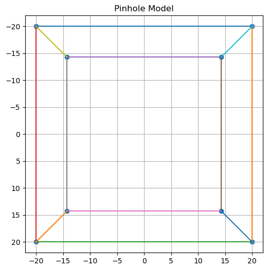
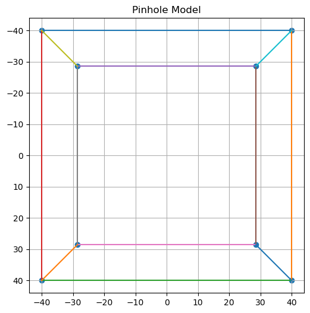
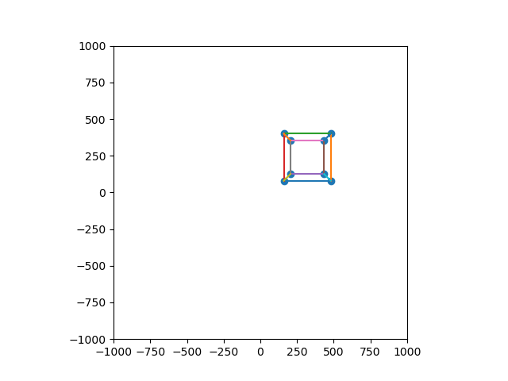
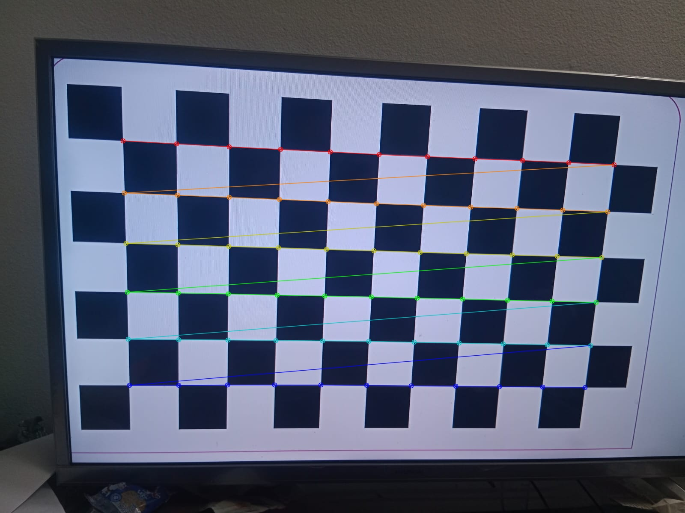
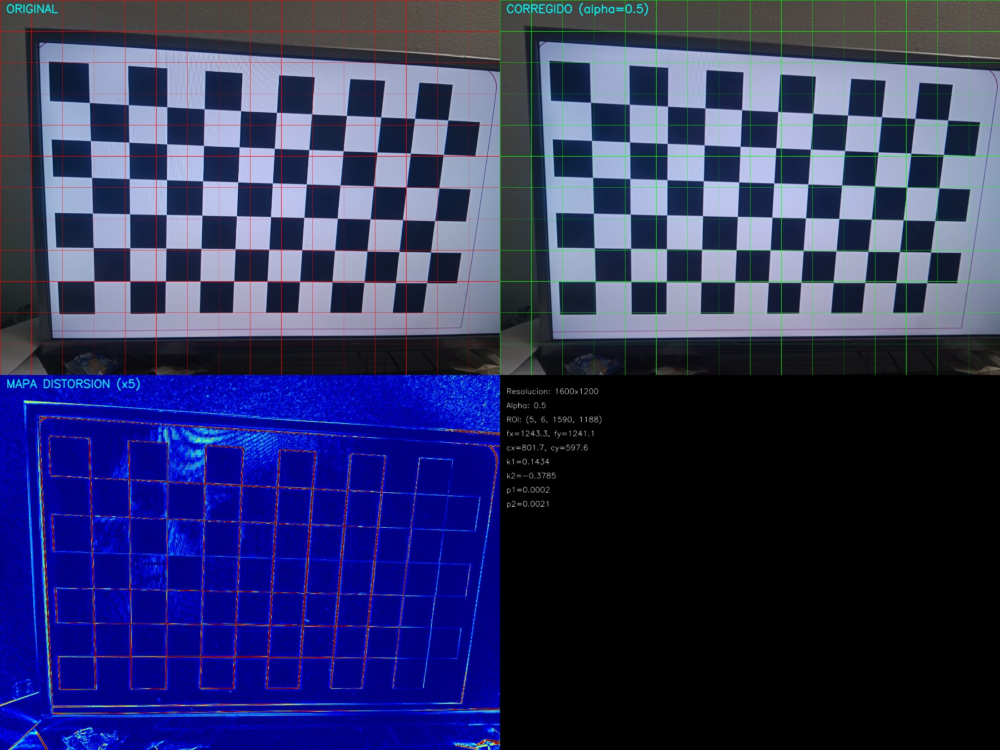
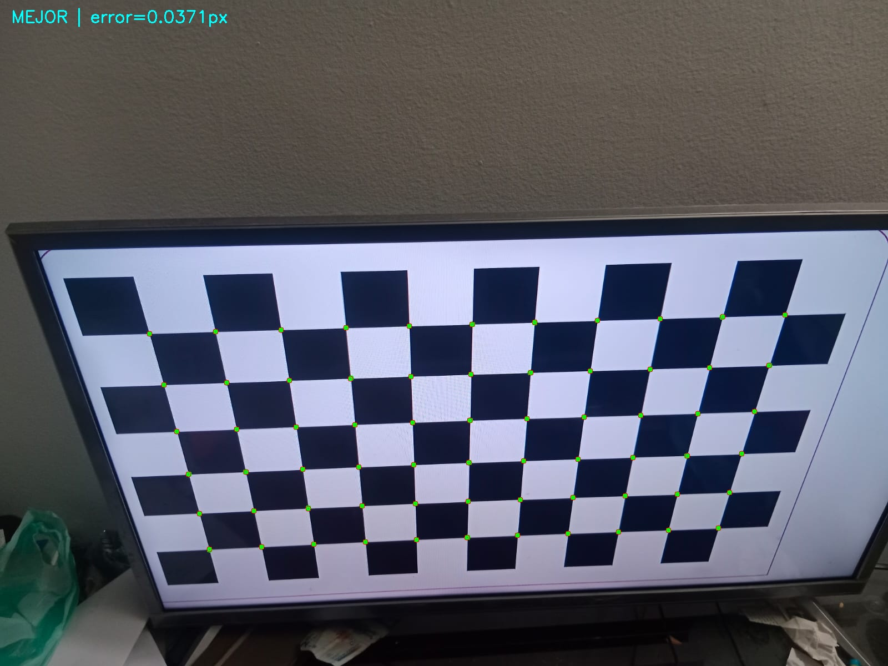
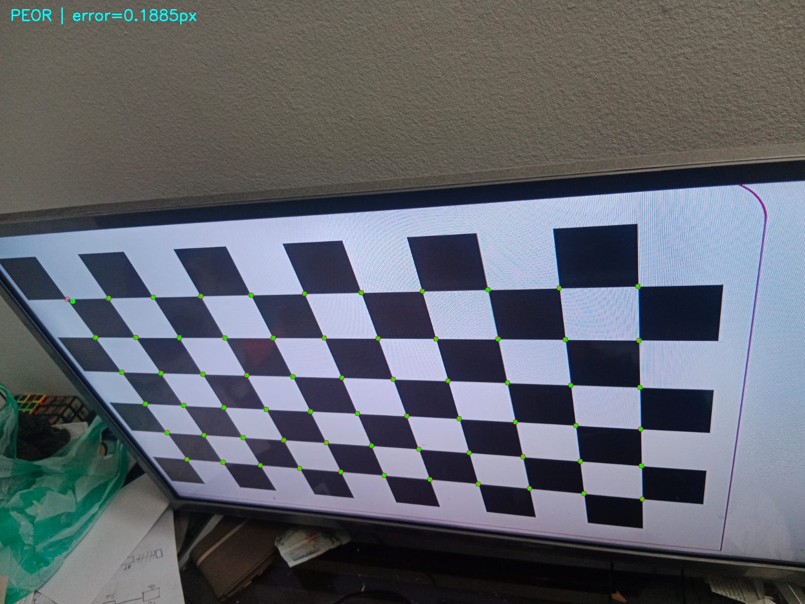
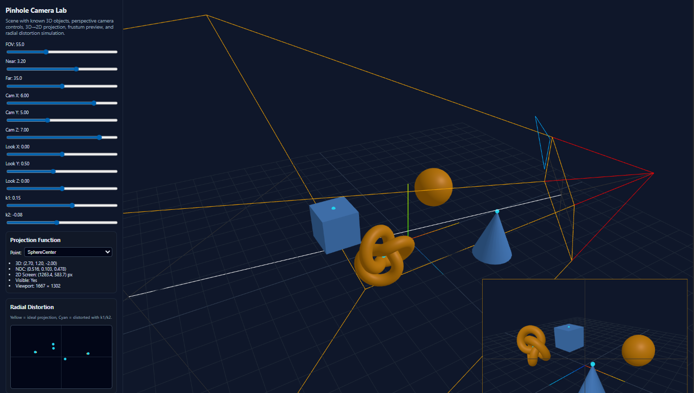
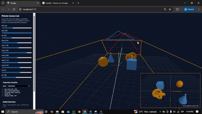

# Taller Camara Pinhole Calibracion

**Estudiante:** Grupo #4

**Fecha de entrega:** 26 de febrero, 2026

---

## 📋 Descripción breve

En este taller se implementó el modelo de cámara pinhole, el uso de parámetros intrínsecos y extrínsecos, la calibración de cámara con patrón de ajedrez y la corrección de distorsión radial usando **Python + OpenCV**.  
Como complemento visual e interactivo, también se desarrolló una escena en **Three.js** para explorar proyección 3D→2D, frustum de cámara y distorsión radial ajustable en tiempo real.

Objetivo principal cumplido: conectar la formulación matemática de visión por computador con resultados prácticos medibles (matriz `K`, coeficientes de distorsión y error de reproyección).

---

## 🛠️ Implementaciones

### 1) Entorno Python (OpenCV + NumPy + Matplotlib)

**Archivo principal:** `python/camara_pinhole_calibration.ipynb`

**Herramientas utilizadas:**
- `opencv-python`
- `numpy`
- `matplotlib`

#### 1.1 Modelo pinhole desde cero

Se implementó proyección perspectiva básica con la ecuación:

- $x' = f\cdot\frac{X}{Z}$
- $y' = f\cdot\frac{Y}{Z}$

Función implementada en notebook:
- `projected_points(points_3d, f)`

También se construyó un cubo 3D (vértices + aristas) y su visualización proyectada en 2D para observar el efecto de la distancia focal.

#### 1.2 Parámetros intrínsecos

Se implementó la matriz intrínseca:

$$
K =
\begin{bmatrix}
f_x & 0 & c_x \\
0 & f_y & c_y \\
0 & 0 & 1
\end{bmatrix}
$$

con función:
- `project_with_intrinsics(points_3d, K)`

#### 1.3 Parámetros extrínsecos

Se modeló la transformación mundo→cámara con:

- Matriz de rotación `R` (incluyendo `rotation_y(theta)`)
- Vector de traslación `t`

Funciones implementadas:
- `transform_world_to_camera(points, R, t)`
- `project_full(points_world, K, R, t)`

Además, se generó una animación del cubo rotando (`cube_rotation.gif`) para observar cambios de proyección ante movimiento de cámara/escena.

#### 1.4 Calibración de cámara con patrón de ajedrez

Se procesaron imágenes en `calibration_images/` usando:

- `cv2.findChessboardCorners()`
- `cv2.cornerSubPix()`
- `cv2.calibrateCamera()`

Se extrajeron:
- Matriz intrínseca calibrada `K`
- Coeficientes de distorsión `dist`
- Vectores extrínsecos `rvecs`, `tvecs`

Y se guardaron en:
- `media/camera_parameters.npz`

#### 1.5 Corrección de distorsión

Se aplicó:
- `cv2.getOptimalNewCameraMatrix()`
- `cv2.undistort()`

con visualización comparativa (original vs corregida), grilla de líneas y mapa de diferencia amplificado.

Salida principal:
- `media/undistort_analysis.jpg`

#### 1.6 Validación de calibración (error de reproyección)

Se proyectaron de nuevo puntos 3D conocidos con:
- `cv2.projectPoints()`

y se calculó error por imagen + error medio global en píxeles:

- clasificación usada en notebook: `EXCELENTE` (< 0.5 px), `BUENA` (< 1.0 px), `MEJORABLE`.

Se exportaron imágenes de validación:
- `media/reproyeccion_mejor.jpg`
- `media/reproyeccion_peor.jpg`

---

### 2) Entorno Three.js (React + Vite)

**Archivos principales:**
- `threejs/src/App.jsx`
- `threejs/src/App.css`

Implementación interactiva de un laboratorio de cámara pinhole con:

1. **Escena 3D con objetos conocidos**
	- Cubo, esfera, cono y torus knot.
	- Puntos de referencia marcados (`CubeCenter`, `CubeTop`, etc.).

2. **PerspectiveCamera configurable**
	- Parámetros ajustables en tiempo real: `fov`, `near`, `far`, posición de cámara (`cameraX/Y/Z`) y punto objetivo (`lookX/Y/Z`).

3. **Función 3D → 2D de pantalla**
	- `projectWorldToScreen(point, camera, width, height)`
	- Retorna coordenadas de pantalla, NDC y visibilidad.

4. **Visualización de frustum**
	- `THREE.CameraHelper(projectionCamera)` en la vista observadora.
	- Inset de render desde la cámara de proyección.

5. **Simulación de distorsión radial**
	- Modelo con coeficientes `k1`, `k2`:
	  - $r^2 = x^2 + y^2$
	  - $x_d = x(1 + k_1r^2 + k_2r^4)$
	  - $y_d = y(1 + k_1r^2 + k_2r^4)$
	- Visualización en canvas: punto ideal (amarillo) vs distorsionado (cian).

6. **Herramienta interactiva de ajuste**
	- Panel lateral con sliders para todos los parámetros.
	- Lectura de coordenadas 3D, NDC y 2D por punto seleccionado.

---

## 📸 Resultados visuales

### Python (evidencia generada)


*Proyección con diferente distancia focal 100 para comparar.* 


*Proyección con diferente distancia focal 200 para comparar.* 


*Proyección del cubo en 2D con movimiento (modelo pinhole + extrínsecos).* 


*Detección de esquinas del tablero para calibración.*


*Comparación original vs corregida, con grilla y mapa de distorsión.*


*Caso con menor error de reproyección.*


*Caso con mayor error de reproyección.*

### Three.js (evidencia)

Ejemplo de referencia en README:


*Escena con objetos conocidos y frustum de la cámara de proyección.*


*Ajuste interactivo de parámetros intrínsecos/extrínsecos y distorsión radial.*

---

## 💻 Código relevante

### Python — proyección pinhole básica

```python
def projected_points(points_3d, f):
	 projected_points = []
	 for X, Y, Z in points_3d:
		  x = f * X / Z
		  y = f * Y / Z
		  projected_points.append([x, y])
	 return np.array(projected_points)
```

### Python — pipeline completo con intrínsecos + extrínsecos

```python
def project_full(points_world, K, R, t):
	 points_cam = transform_world_to_camera(points_world, R, t)
	 projected = []
	 for X, Y, Z in points_cam:
		  point = K @ np.array([X, Y, Z])
		  point = point / point[2]
		  projected.append(point[:2])
	 return np.array(projected)
```

### Python — calibración y error de reproyección

```python
ret, K, dist, rvecs, tvecs = cv2.calibrateCamera(
	 objpoints, imgpoints, gray.shape[::-1], None, None
)

errors = []
for obj, img_pts, rvec, tvec in zip(objpoints, imgpoints, rvecs, tvecs):
	 projected, _ = cv2.projectPoints(obj, rvec, tvec, K, dist)
	 errors.append(cv2.norm(img_pts, projected, cv2.NORM_L2) / len(projected))

mean_error = np.mean(errors)
```

### Three.js — proyección 3D→2D en pantalla

```javascript
function projectWorldToScreen(point, camera, width, height) {
  const ndc = point.clone().project(camera)
  const x = (ndc.x * 0.5 + 0.5) * width
  const y = (-ndc.y * 0.5 + 0.5) * height
  const visible = ndc.z >= -1 && ndc.z <= 1 && Math.abs(ndc.x) <= 1 && Math.abs(ndc.y) <= 1
  return { x, y, ndc, visible }
}
```

### Three.js — distorsión radial

```javascript
const r2 = x * x + y * y
const distortionFactor = 1 + k1 * r2 + k2 * r2 * r2
const xd = x * distortionFactor
const yd = y * distortionFactor
```

---

## 🤖 Prompts utilizados

Se utilizó IA generativa como apoyo para estructurar y completar partes del desarrollo.

Prompts principales empleados:

1. **Three.js:**
	- "on semana_2_3/threejs create a 3D scene with knows objects and implement perspective camera with configurable parametes and a function to convert 3D coorditates into 2D coordinates on screen, visualize frustrum of camera , simulate distortion of radial lens and finally an interactive tool to adjust parameters."

2. **Documentación README:**
	- "guíate de los readme.md de semanas 1_3 y 1_4 para crear README.md de semana_2_3, contemplando python y threejs con todos los requisitos del taller."

---

## 📚 Aprendizajes y dificultades

### Aprendizajes
- Comprensión práctica del modelo pinhole y su relación con álgebra lineal.
- Diferencia entre parámetros intrínsecos y extrínsecos en proyección.
- Flujo completo de calibración con OpenCV, desde detección de esquinas hasta validación por reproyección.
- Interpretación visual de distorsión radial y su corrección.
- Construcción de herramienta interactiva en Three.js para experimentar con parámetros de cámara.

### Dificultades
- Detectar tablero de forma robusta en todas las imágenes (ángulos/iluminación).
- Ajustar visualmente undistort sin introducir recortes excesivos (parámetro `alpha`).
- Mantener sincronizado el cálculo matemático de proyección y la visualización en tiempo real en Three.js.

---

## 📁 Estructura de carpetas

```text
semana_2_3_camara_pinhole_calibracion/
├── python/
│   └── camara_pinhole_calibration.ipynb
├── threejs/
│   ├── src/
│   │   ├── App.jsx
│   │   ├── App.css
│   │   └── index.css
│   └── ...
├── media/
│   ├── camera_parameters.npz
│   ├── cube_rotation.gif
│   ├── detected_corners.jpg
│   ├── undistort_analysis.jpg
│   ├── reproyeccion_mejor.jpg
│   └── reproyeccion_peor.jpg
├── calibration_images/
└── README.md
```

---

## ✅ Criterios de evaluación (auto-chequeo)

- [x] Cumplimiento del objetivo del taller (modelo pinhole + calibración + corrección + validación).
- [x] Implementación en Python documentada y con resultados exportados.
- [x] Implementación en Three.js documentada (escena, cámara, frustum, distorsión, controles).
- [x] README completo con secciones requeridas.
- [x] Repositorio organizado en la estructura solicitada.
- [x ] Confirmar mínimo **2 capturas/GIF** explícitas para Three.js en `media/` (si aún no se han exportado).


